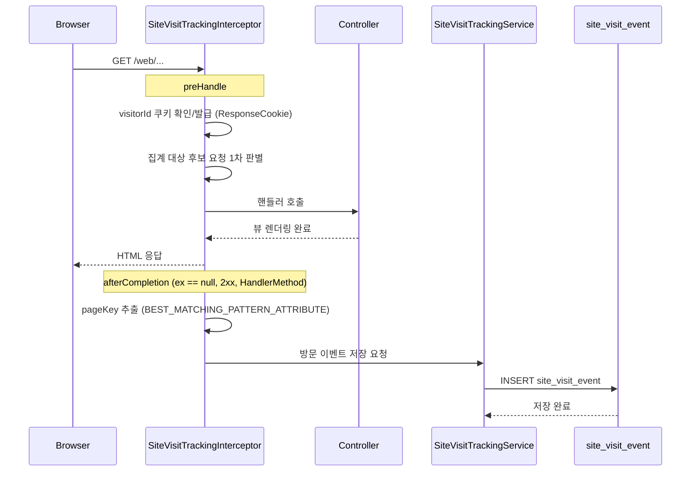
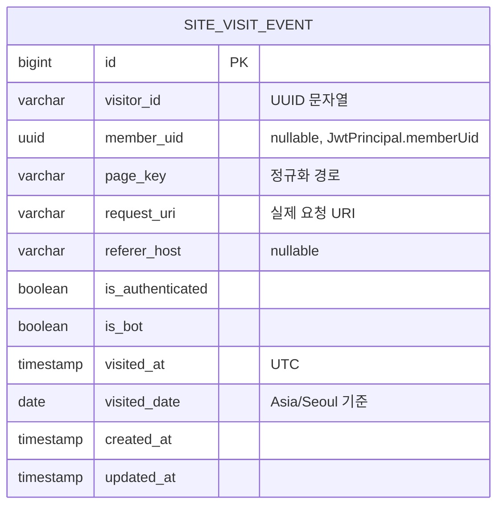

# 사이트 방문자수 집계 기능 설계 문서

## 구현 상태

설계 완료, 미구현.

이 문서는 ElSeeker 사이트의 방문자수 집계 기능을 현재 프로젝트 구조에 맞춰 설계한 문서이다.

---

## 1. 개요

### 1.1 목적

운영자가 다음 지표를 확인할 수 있도록 사이트 방문 집계 기능을 추가한다.

- 일별 전체 방문 수(Page View)
- 일별 고유 방문자 수(Unique Visitor)
- 페이지별 방문 수
- 최근 7일 / 30일 방문 추이

방문자수 집계는 **회원가입 여부와 관계없이** 수행한다.
즉, 로그인 회원과 비회원(익명 사용자) 모두 방문자수에 포함한다.

### 1.2 설계 목표

- 기존 Spring Boot + SSR(Thymeleaf) 구조를 깨지 않고 공통 방식으로 수집한다.
- 회원가입하지 않은 사용자와 로그인 사용자를 모두 집계할 수 있어야 한다.
- 관리자 화면/API에서 바로 조회 가능한 수준으로 단순하고 운영 가능한 구조를 우선한다.
- 개인정보를 과도하게 저장하지 않는다.

### 1.3 범위

이번 기능의 범위는 **웹 페이지 방문 집계**이다.

집계 대상:
- `/`
- `/web/**` 하위의 SSR 페이지

집계 제외:
- `/api/**`
- `/web/admin/**`
- `/web/auth/**` (로그인/로그아웃 처리 페이지)
- 정적 리소스 (`/css/**`, `/js/**`, `/images/**`, `/webjars/**`, `/favicon.ico`, `/robots.txt`, `/sitemap.xml` 등)
- OAuth 콜백 (`/oauth2/**`, `/login/oauth2/**`)
- 에러 페이지 (`/error`), 리다이렉트 응답

> 즉, “사이트 방문자수”는 API 호출 수가 아니라 사용자가 실제로 본 HTML 페이지 기준으로 정의한다.
> 또한 사이트 방문자수는 회원가입 여부와 무관하게 집계한다.

---

## 2. 핵심 용어 정의

| 용어 | 정의 |
|------|------|
| 방문 이벤트 (`visit event`) | 집계 대상 페이지 1회 요청 |
| 페이지뷰 (`page view`) | 집계 조건을 통과한 방문 이벤트 수의 합 |
| 일별 고유 방문자 (`daily unique visitor`) | 같은 날짜에 같은 `visitorId`로 방문한 사용자를 1명으로 계산한 값 |
| 기간 고유 방문자 (`period unique visitor`) | 조회 기간 전체에서 같은 `visitorId`를 1명으로 계산한 값 |
| 비회원 방문자 (`guest visitor`) | 회원가입하지 않았거나 로그인하지 않은 상태의 방문자 |
| 페이지 키 (`pageKey`) | 집계용 정규화 경로. Spring의 `BEST_MATCHING_PATTERN_ATTRIBUTE` 값을 사용 |
| 비즈니스 날짜 (`visitedDate`) | 운영 통계 기준 날짜. `Asia/Seoul` 기준으로 계산 |

### 2.1 방문자 식별 기준

고유 방문자는 회원가입 여부와 관계없이 **브라우저 쿠키 기반 `visitorId`** 로 식별한다.

- 쿠키명: `es_visitor_id`
- 값: UUID
- 속성: `Path=/`, `HttpOnly`, `SameSite=Lax`, HTTPS 환경에서는 `Secure`
- 만료: 365일

`Path=/`는 필수이다. 이 속성이 없으면 최초 방문 경로 기준으로 쿠키 스코프가 좁아져,
같은 브라우저 사용자가 `/`, `/web/study`, `/web/game`를 이동할 때 서로 다른 방문자로 집계될 수 있다.

이 방식의 장점:
- 비회원 방문자도 집계 가능
- 로그인 전/후를 같은 브라우저 안에서 연속적으로 추적 가능
- 구현 복잡도가 낮음

이 방식의 한계:
- 사용자가 브라우저/기기를 바꾸면 다른 방문자로 집계된다
- 쿠키 삭제 시 새로운 방문자로 집계된다

위 한계는 일반적인 웹 분석 기준에서는 허용 가능하다.

---

## 3. 요구사항

### 3.1 기능 요구사항

| ID | 요구사항 | 설명 |
|----|----------|------|
| V-01 | 방문자 식별 쿠키 발급 | 최초 방문 시 `es_visitor_id` 쿠키 생성 |
| V-02 | 페이지 방문 이벤트 저장 | 집계 대상 HTML 요청마다 이벤트 저장 |
| V-03 | 일별 방문 통계 조회 | 날짜별 페이지뷰/일별 고유 방문자 수 조회 |
| V-04 | 페이지별 통계 조회 | 특정 날짜 기준 페이지별 방문 수 조회 |
| V-05 | 관리자 전용 제공 | `/api/v1/admin/**`, `/web/admin/**` 에서만 조회 가능 |
| V-06 | 봇/비정상 요청 플래깅 | 명백한 봇 User-Agent는 `is_bot = true` 로 저장하고, 조회 쿼리에서 `is_bot = false` 조건으로 제외 |
| V-07 | 기간 기준 요약 통계 조회 | 최근 7일/30일 페이지뷰 합계, 기간 고유 방문자 수 조회 |
| V-08 | 비회원 포함 집계 | 회원가입하지 않은 사용자도 방문자수에 포함 |

### 3.2 비기능 요구사항

- 페이지 응답 흐름에 기능 추가가 있더라도 사용자 체감 성능 저하가 크지 않아야 한다.
- 중복 집계 기준이 명확해야 한다.
- 운영 초기에 구현/디버깅이 쉬워야 한다.
- 추후 통계 확장(리퍼러, 국가, 디바이스, 롤업 테이블)에 대응 가능해야 한다.

### 3.3 집계 기준 명시

- 방문자수는 회원가입 여부와 무관하게 집계한다.
- 비회원 방문자는 `member_uid = NULL`, `is_authenticated = false` 상태로 저장한다.
- 로그인 사용자는 `JwtPrincipal.memberUid` 값을 `member_uid` 컬럼에 저장한다. (현재 `JwtPrincipal`은 `memberUid: UUID` 만 제공하며 `memberId: Long` 을 제공하지 않는다. 로그 적재 시점에 추가 DB 조회를 피하기 위해 UUID 를 직접 저장한다.)
- 일별 차트의 `uniqueVisitorCount`는 **일별 고유 방문자 수**이다.
- 최근 7일/30일 KPI의 `uniqueVisitorCount`는 **기간 고유 방문자 수**이다.
- 따라서 `최근 30일 고유 방문자 수`는 `일별 고유 방문자 수의 단순 합`과 같지 않다.

---

## 4. 설계 방안

### 4.1 권장 구현 전략

초기 버전은 **원시 이벤트 저장 + 관리자 집계 조회 방식**으로 구현한다.

이유:
- 트래픽 규모가 매우 큰 서비스가 아니면 구조가 가장 단순하다.
- 일단 데이터를 잃지 않고 쌓아두면 이후 집계 방식 변경이 쉽다.
- H2 / PostgreSQL 양쪽에서 무리 없이 구현 가능하다.
- UPSERT 중심의 복잡한 동시성 제어 없이도 정확한 통계를 낼 수 있다.

향후 이벤트 수가 크게 늘어나면 `site_visit_daily_stat` 롤업 테이블을 추가하는 2단계 확장을 적용한다.

### 4.2 신규 모듈 제안

방문 집계는 특정 도메인에 종속되지 않으므로 `common`에 섞기보다 **신규 `analytics` 모듈**로 분리하는 것이 적절하다.

예상 패키지 구조:

```text
src/main/kotlin/com/elseeker/analytics
├─ adapter
│  ├─ input
│  │  ├─ api/admin
│  │  └─ web
│  └─ output/jpa
├─ application/service
├─ domain/model
└─ domain/vo
```

예상 파일:

- `analytics/adapter/input/web/SiteVisitTrackingInterceptor.kt`
- `analytics/config/AnalyticsWebConfig.kt`
- `analytics/application/service/SiteVisitTrackingService.kt`
- `analytics/application/service/SiteVisitStatsQueryService.kt`
- `analytics/domain/model/SiteVisitEvent.kt`
- `analytics/adapter/output/jpa/SiteVisitEventRepository.kt`
- `analytics/adapter/input/api/admin/AdminAnalyticsApi.kt`
- `analytics/adapter/input/api/admin/AdminAnalyticsApiDocument.kt`

### 4.3 수집 방식

Spring MVC `HandlerInterceptor`를 사용해 공통 수집한다.

선정 이유:
- 현재 프로젝트는 SSR 페이지가 `/` 및 `/web/**` 컨트롤러에 명확히 존재한다.
- 컨트롤러 코드를 수정하지 않고 공통 적용 가능하다.
- `HandlerMapping.BEST_MATCHING_PATTERN_ATTRIBUTE` 를 통해 집계용 정규화 경로를 쉽게 얻을 수 있다.
- Security 필터 이후 동작하므로 로그인 사용자 정보(`JwtPrincipal`)도 함께 참조할 수 있다.

### 4.4 처리 흐름



> 저장은 응답이 이미 클라이언트로 전송된 뒤의 `afterCompletion` 단계에서 이루어지므로 INSERT 지연이 사용자 체감 응답 시간에 직접 영향을 주지 않는다.

### 4.5 집계 조건

다음 조건을 모두 만족할 때만 이벤트를 저장한다.

- HTTP Method = `GET`
- 요청 경로가 `/` 또는 `/web/**`
- 요청 경로가 제외 목록에 포함되지 않음
- 요청이 `HandlerMethod` 에 매핑됨 (정적 리소스 `ResourceHttpRequestHandler` 는 자동 제외)
- `BEST_MATCHING_PATTERN_ATTRIBUTE` 값이 존재함
- 응답 상태가 2xx (권장: 200)
- `afterCompletion(..., ex)` 의 `ex` 가 `null`

### 4.6 봇 판정 정책

봇 여부는 **저장 시점에 제외하지 않고** `is_bot` 컬럼으로 기록한다.
조회 쿼리에서 `is_bot = false` 조건으로 필터링한다.

이유:
- 봇 통계 자체가 향후 운영 지표가 될 수 있다.
- 판정 기준이 바뀌어도 과거 데이터를 재활용할 수 있다.

봇 판정 예시(대소문자 무시 부분 일치):
- `bot`
- `crawler`
- `spider`
- `slurp`
- `curl`
- `wget`
- `facebookexternalhit`
- 빈 문자열 또는 `User-Agent` 헤더 없음

> 완전한 봇 차단은 어렵다. 초기 버전은 “명백한 자동 요청 플래깅” 수준으로 둔다.

---

## 5. 데이터 모델

### 5.1 1차 버전: 원시 이벤트 테이블



`member` 테이블과 논리적 관계가 있으나 FK 제약은 두지 않는다.
- 분석 테이블이 회원 삭제 시 cascade 영향을 받지 않도록 독립 보관한다.
- `member.uid` 에 유니크 인덱스가 있으므로 필요 시 uid 기준으로 JOIN 가능하다.

### 5.2 테이블 정의

| 컬럼 | 타입 | 설명 |
|------|------|------|
| `id` | BIGINT PK | 방문 이벤트 ID |
| `visitor_id` | VARCHAR(36) NOT NULL | 쿠키 기반 방문자 식별자 (UUID 문자열) |
| `member_uid` | UUID NULL (PostgreSQL) / VARCHAR(36) NULL (H2) | 로그인 사용자의 `JwtPrincipal.memberUid`, 비회원은 `NULL` |
| `page_key` | VARCHAR(160) NOT NULL | 정규화 경로 |
| `request_uri` | VARCHAR(255) NOT NULL | 실제 요청 URI, 쿼리스트링 제외 |
| `referer_host` | VARCHAR(120) NULL | 리퍼러 전체 URL이 아니라 host만 저장 |
| `is_authenticated` | BOOLEAN NOT NULL | 로그인 상태 여부. 비회원 방문자는 `false` |
| `is_bot` | BOOLEAN NOT NULL | 봇 필터 판정 결과 |
| `visited_at` | TIMESTAMP NOT NULL | 방문 시각(UTC, `Instant`) |
| `visited_date` | DATE NOT NULL | KST(Asia/Seoul) 기준 집계 날짜 |
| `created_at` | TIMESTAMP NOT NULL | 생성 시각 (`BaseTimeEntity`) |
| `updated_at` | TIMESTAMP NOT NULL | 수정 시각 (`BaseTimeEntity`) |

> `BaseTimeEntity` 를 상속하면 `created_at`, `updated_at` 이 자동으로 관리된다. 이벤트 레코드는 UPDATE가 필요 없으므로 두 값이 동일하게 찍힌다.

### 5.3 인덱스

```sql
create index idx_site_visit_event_visited_date
    on site_visit_event (visited_date);

create index idx_site_visit_event_visited_date_page_key
    on site_visit_event (visited_date, page_key);

create index idx_site_visit_event_visited_date_visitor_id
    on site_visit_event (visited_date, visitor_id);

create index idx_site_visit_event_member_uid_visited_date
    on site_visit_event (member_uid, visited_date);
```

### 5.4 스키마 반영 전략

이 프로젝트는 환경별 스키마 생성 방식이 다르므로, 방문 집계 테이블 추가 시 이를 함께 고려해야 한다.

- 로컬 개발(`application-local.yml`): `spring.jpa.hibernate.ddl-auto=create` → 엔티티 추가 시 PostgreSQL 로컬 DB에 테이블이 매 부팅마다 재생성된다. 재부팅 시 수집된 방문 이벤트가 초기화됨에 유의한다.
- 테스트(`application-test.yml`): `spring.jpa.hibernate.ddl-auto=update` + Testcontainers → 엔티티 추가 시 테스트 컨테이너에 테이블이 자동 생성된다. `DatabaseCleaner` 의 truncate 대상 목록에 `site_visit_event` 추가가 필요한지 확인해야 한다.
- 기본/운영(`application.yml`, `application-prod.yml`): `ddl-auto=none` → 엔티티만 추가해서는 테이블이 생성되지 않는다.

따라서 초기 구현 산출물에는 아래가 포함되어야 한다.

1. `SiteVisitEvent` JPA 엔티티 (`BaseTimeEntity` 상속)
2. 운영 반영용 DDL SQL
3. 운영 배포 전에 DDL을 먼저 적용하는 절차 문서

운영 반영용 DDL에는 최소한 다음이 포함되어야 한다.

- `site_visit_event` 테이블 생성
- `visited_date`, `page_key`, `visitor_id`, `member_uid` 인덱스 생성 (§5.3 참조)

`member_uid` 는 `member.uid` 와 논리적으로 연결되지만 FK 제약은 두지 않는다. (회원 삭제 시 분석 데이터가 cascade 영향을 받지 않도록 하기 위함)

로컬 프로필에서 방문 통계 기능을 바로 확인하려면, 필요 시 `application-local.yml` 의 `spring.sql.init.data-locations` 목록에
분석용 초기 데이터 SQL이 아니라 **추가 인덱스/보조 SQL** 만 별도로 넣는 방식을 검토할 수 있다.
단, 기본 테이블 생성 책임은 로컬에서는 JPA, 운영에서는 수동 DDL에 둔다.

### 5.5 `pageKey` 규칙

`requestURI` 원문을 그대로 집계 키로 쓰지 않고,
Spring MVC의 `HandlerMapping.BEST_MATCHING_PATTERN_ATTRIBUTE` 값을 사용한다.

예시:

| 실제 URI | pageKey |
|---------|---------|
| `/` | `/` |
| `/web/study` | `/web/study` |
| `/web/community/15` | `/web/community/{postId}` |
| `/web/game/bible-word-puzzle/play` | `/web/game/bible-word-puzzle/play` |

장점:
- 동적 경로가 정규화되어 통계가 쪼개지지 않는다.
- 관리자 화면에서 “어떤 화면이 많이 보였는지” 판단하기 쉽다.

---

## 6. 조회 쿼리 설계

### 6.1 일별 전체 방문 통계

```sql
SELECT
    visited_date,
    COUNT(*) AS page_view_count,
    COUNT(DISTINCT visitor_id) AS unique_visitor_count
FROM site_visit_event
WHERE visited_date BETWEEN :fromDate AND :toDate
  AND is_bot = false
GROUP BY visited_date
ORDER BY visited_date ASC;
```

### 6.2 특정 날짜의 페이지별 통계

```sql
SELECT
    page_key,
    COUNT(*) AS page_view_count,
    COUNT(DISTINCT visitor_id) AS unique_visitor_count
FROM site_visit_event
WHERE visited_date = :date
  AND is_bot = false
GROUP BY page_key
ORDER BY page_view_count DESC, page_key ASC;
```

### 6.3 로그인 사용자 비중 조회

```sql
SELECT
    visited_date,
    COUNT(*) FILTER (WHERE is_authenticated = true) AS authenticated_page_views,
    COUNT(DISTINCT CASE WHEN is_authenticated = true THEN member_uid END) AS authenticated_unique_members
FROM site_visit_event
WHERE visited_date BETWEEN :fromDate AND :toDate
  AND is_bot = false
GROUP BY visited_date
ORDER BY visited_date ASC;
```

> PostgreSQL에서는 `FILTER` 문법을 사용할 수 있다. H2 호환성이 필요하면 `SUM(CASE WHEN ... THEN 1 ELSE 0 END)` 형태로 대체한다.
>
> 로그인 고유 방문자 수는 `member_uid` 기준이 정확하다. (같은 회원이 두 기기에서 접속해도 1명으로 집계됨) 반대로 브라우저 단위 측정이 필요하면 `visitor_id` 를 사용한다.

### 6.4 기간 요약 통계

```sql
SELECT
    COUNT(*) AS total_page_view_count,
    COUNT(DISTINCT visitor_id) AS period_unique_visitor_count,
    COUNT(DISTINCT CASE WHEN is_authenticated = true THEN member_uid END) AS period_authenticated_unique_member_count
FROM site_visit_event
WHERE visited_date BETWEEN :fromDate AND :toDate
  AND is_bot = false;
```

이 쿼리는 최근 7일/30일 KPI 용도이다.

중요:
- 이 값은 일별 `uniqueVisitorCount` 를 더한 값과 다를 수 있다.
- 재방문 사용자는 기간 내에서 1명으로만 계산한다.
- `period_unique_visitor_count` 는 브라우저(쿠키) 기준이고, `period_authenticated_unique_member_count` 는 회원 기준이다. 한 회원이 여러 기기에서 접속하면 두 값이 달라진다.

---

## 7. 관리자 API / 화면 설계

### 7.1 관리자 API

#### 7.1.1 일별 방문 요약 조회

`GET /api/v1/admin/analytics/visitors/summary?from=2026-04-01&to=2026-04-18`

응답 예시:

```json
{
  "from": "2026-04-01",
  "to": "2026-04-18",
  "items": [
    {
      "date": "2026-04-16",
      "pageViewCount": 421,
      "uniqueVisitorCount": 182
    },
    {
      "date": "2026-04-17",
      "pageViewCount": 508,
      "uniqueVisitorCount": 211
    }
  ]
}
```

#### 7.1.2 기간 KPI 요약 조회

`GET /api/v1/admin/analytics/visitors/overview?from=2026-04-01&to=2026-04-18`

응답 예시:

```json
{
  "from": "2026-04-01",
  "to": "2026-04-18",
  "totalPageViewCount": 8124,
  "periodUniqueVisitorCount": 1327,
  "periodAuthenticatedUniqueMemberCount": 418
}
```

- `periodUniqueVisitorCount`: 기간 내 브라우저 쿠키 기준 고유 방문자
- `periodAuthenticatedUniqueMemberCount`: 기간 내 로그인 회원(`member_uid`) 기준 고유 방문자

#### 7.1.3 특정 날짜 페이지별 방문 통계

`GET /api/v1/admin/analytics/visitors/pages?date=2026-04-18&page=0&size=20`

응답 예시:

```json
{
  "content": [
    {
      "pageKey": "/",
      "pageViewCount": 180,
      "uniqueVisitorCount": 121
    },
    {
      "pageKey": "/web/study",
      "pageViewCount": 74,
      "uniqueVisitorCount": 48
    }
  ],
  "page": 0,
  "size": 20,
  "totalElements": 12,
  "totalPages": 1
}
```

### 7.2 관리자 웹 화면

방문자 통계는 별도 페이지를 만들지 않고 **관리자 대시보드 (`/web/admin`, `templates/admin/admin-dashboard.html`)** 에 통합한다.

화면 구성 (대시보드 상단에 배치):

- KPI 카드 5종
  - 오늘 페이지뷰
  - 오늘 고유 방문자 (브라우저 기준)
  - 최근 7일 페이지뷰 합계
  - 최근 30일 고유 방문자 (브라우저 기준)
  - 최근 30일 고유 회원
- 일별 추이 라인 차트 (순수 SVG, 기본 구간: 최근 30일, 날짜 범위 변경 가능)
- 일별 통계 테이블
- 페이지별 방문 순위 테이블 (기본 날짜: 오늘, 페이지네이션)

대시보드 하단에는 기존 "빠른 이동" 카드 영역 (회원/사전/번역본/퀴즈)을 유지한다.

> 관리자 웹(`/web/admin/**`)은 `SecurityConfig` 의 `hasRole("ADMIN")` 규칙으로 보호된다. 대시보드 라우트(`/web/admin`)는 `AdminBibleWebController.dashboard()` 가 담당한다 (이 프로젝트의 기존 상태).

초기 버전은 API만 먼저 구현하고, 관리자 화면은 후속 작업으로 분리해도 된다.

---

## 8. 구현 상세 설계

### 8.1 인터셉터 책임

`SiteVisitTrackingInterceptor`

- `preHandle`
  - `es_visitor_id` 쿠키 확인
  - 없으면 새 UUID 생성 후 응답 쿠키 설정 (응답이 커밋되기 전에 설정해야 함)
  - 집계 대상 후보 요청인지 1차 판별 (HTTP Method, 경로, `HandlerMethod` 여부)
  - `true` 를 반환하여 다음 체인으로 진행

- `afterCompletion(request, response, handler, ex)`
  - `ex != null` 이면 저장하지 않음
  - `response.status` 가 2xx 가 아니면 저장하지 않음
  - `handler` 가 `HandlerMethod` 가 아니면 저장하지 않음 (정적 리소스 핸들러 등은 제외)
  - `pageKey = request.getAttribute(HandlerMapping.BEST_MATCHING_PATTERN_ATTRIBUTE)` 를 추출 (없으면 `request.requestURI` 를 fallback 으로 사용)
  - `SecurityContextHolder` 에서 `JwtPrincipal` 존재 여부 확인
  - `SiteVisitTrackingService` 호출

> 저장 자체는 짧은 트랜잭션으로 처리하며, 실패해도 사용자 요청에는 영향을 주지 않도록 try-catch 로 방어하고 로그만 남긴다.

### 8.2 서비스 책임

`SiteVisitTrackingService`

- 방문 이벤트 엔티티 생성
- 로그인 사용자는 `JwtPrincipal.memberUid` (UUID) 를 `member_uid` 로 저장 (별도 DB 조회 없이 기록)
- 비회원 방문자는 `member_uid = NULL` 로 저장
- `is_authenticated` 는 `JwtPrincipal` 유무로 결정
- `visitedAt` 은 UTC `Instant`
- `visitedDate` 는 `Asia/Seoul` 기준 `LocalDate` (`LocalDate.now(ZoneId.of("Asia/Seoul"))`)
- 리퍼러 host 추출 (`Referer` 헤더에서 `URI.create(...).host` 만 추출, 실패 시 `null`)
- 봇 여부 판정 후 `is_bot` 필드에 저장
- JPA Repository 저장

### 8.3 WebMvc 설정

`AnalyticsWebConfig : WebMvcConfigurer`

인터셉터 등록 경로:

- 포함: `/`, `/web/**`
- 제외:
  - `/web/admin/**`
  - `/web/auth/**`
  - `/error`

정적 리소스(`/css/**`, `/js/**`, `/images/**`, `/webjars/**`, `/favicon.ico`, `/robots.txt`, `/sitemap.xml`)는 애초에 `/web/**` 대상이 아니므로 자연스럽게 제외된다. 또한 `HandlerMethod` 판별로 2차 필터링된다.

### 8.4 쿠키 발급 세부 규칙

- 쿠키명: `es_visitor_id`
- Path: `/`
- Max-Age: `31536000` (365일)
- HttpOnly: `true`
- SameSite: `Lax`
- Secure: 운영 HTTPS 환경에서는 `true`

최초 방문에서 쿠키가 없으면 발급하고, 이미 있으면 재발급하지 않는다.

> `jakarta.servlet.http.Cookie` 는 Servlet 6(Spring Boot 3.x 호환) 이상에서 `setAttribute("SameSite", "Lax")` 를 지원하지만, 일관성을 위해 Spring 의 `ResponseCookie` 를 사용하여 `Set-Cookie` 헤더를 직접 구성하는 방식을 권장한다. 예:
>
> ```kotlin
> val cookie = ResponseCookie.from("es_visitor_id", uuid)
>     .path("/")
>     .maxAge(Duration.ofDays(365))
>     .httpOnly(true)
>     .sameSite("Lax")
>     .secure(isHttps) // 운영 환경에서 true
>     .build()
> response.addHeader(HttpHeaders.SET_COOKIE, cookie.toString())
> ```

---

## 9. 개인정보 및 보안 고려사항

### 9.1 저장하지 않을 정보

다음 정보는 초기 버전에서 저장하지 않는다.

- 원본 IP 주소
- 전체 User-Agent 문자열
- 전체 Referer URL
- 쿼리스트링

이유:
- 개인정보/민감 정보 저장 가능성을 낮추기 위함
- 방문자수 집계에는 불필요한 상세 데이터이기 때문

### 9.2 저장하는 최소 정보

- `visitor_id`
- `member_uid` (로그인 시, `JwtPrincipal.memberUid`)
- `page_key`
- `request_uri`
- `referer_host`
- `is_authenticated`
- `is_bot`
- `visited_at` (UTC)
- `visited_date` (KST)

### 9.3 쿠키 정책

- `HttpOnly` 로 JavaScript 접근 차단
- `SameSite=Lax` 로 기본적인 CSRF 노출 완화
- HTTPS 운영 환경에서는 `Secure=true`

---

## 10. 성능 및 운영 고려사항

### 10.1 예상 부하

이 기능은 집계 대상 페이지마다 INSERT 1회를 추가한다.

초기 트래픽 규모에서는 충분히 감당 가능하며, 다음 이유로 우선 채택 가능하다.

- 현재 서비스는 대규모 실시간 분석 시스템이 아니다.
- 방문자 통계는 운영 지표 용도이며 쓰기 폭증 가능성이 높지 않다.
- 원시 이벤트 저장은 디버깅과 정책 변경에 유리하다.

### 10.2 보관 정책

권장 보관 정책:

- 원시 이벤트: 180일 보관
- 180일 초과 데이터는 배치로 삭제

향후 롤업 테이블이 생기면:

- 원시 이벤트: 30~90일
- 일별 롤업 통계: 장기 보관

### 10.3 2단계 확장안

이벤트 수가 증가하면 다음 테이블을 추가한다.

- `site_visit_daily_stat`

예상 컬럼:

| 컬럼 | 설명 |
|------|------|
| `stat_date` | 집계 날짜 |
| `page_key` | 페이지 키 |
| `page_view_count` | 페이지뷰 |
| `unique_visitor_count` | 고유 방문자 |
| `created_at` | 생성 시각 |
| `updated_at` | 갱신 시각 |

운영 기준 예시:

- 월 이벤트 수가 수십만~수백만 단위로 증가
- 관리자 조회 응답이 느려짐
- 특정 기간 통계 조회가 잦아짐

그 시점에 스케줄러 또는 배치로 일별 롤업을 추가한다.

---

## 11. 구현 순서 제안

### Phase 1

1. `analytics` 모듈 생성
2. `SiteVisitEvent` 엔티티 (`BaseTimeEntity` 상속) 및 `SiteVisitEventRepository` 추가
3. `SiteVisitTrackingInterceptor` + `AnalyticsWebConfig` 추가 (Spring `ResponseCookie` 기반 SameSite 쿠키)
4. 운영 반영용 DDL SQL 작성 (§5.3, §5.4 기준)
5. 테스트용 `DatabaseCleaner` truncate 목록에 `site_visit_event` 추가 여부 검토
6. 관리자 조회 API 추가 (`AdminAnalyticsApi` + `AdminAnalyticsApiDocument`)
7. Swagger 문서 인터페이스 추가
8. `SecurityConfig` 수정 불필요: `/api/v1/admin/**` 패턴이 이미 `hasRole("ADMIN")` 으로 보호됨

### Phase 2

1. 관리자 웹 페이지 추가
2. 최근 7일/30일 차트 추가
3. 상위 페이지 랭킹 UI 추가

### Phase 3

1. 롤업 테이블 추가
2. 데이터 보관/삭제 배치 추가
3. 리퍼러/유입 채널 분석 확장

---

## 12. 최종 제안

현재 ElSeeker에는 **“원시 방문 이벤트 저장 + 관리자 집계 조회”** 방식이 가장 적합하다.

핵심 이유:

- 구현 복잡도가 낮다
- 회원/비회원 방문자 모두 처리 가능하다
- 현재 프로젝트 구조에 자연스럽게 녹아든다
- 추후 통계 고도화로 확장 가능하다

최초 구현 범위는 아래 3가지를 권장한다.

1. `/` 및 `/web/**` 페이지 방문 이벤트 저장
2. 일별 전체 방문 통계 API
3. 특정 날짜 페이지별 방문 통계 API

이 범위만 먼저 구현해도 운영자가 “오늘 몇 명이 들어왔는지, 어떤 화면이 많이 보였는지”를 확인할 수 있다.
