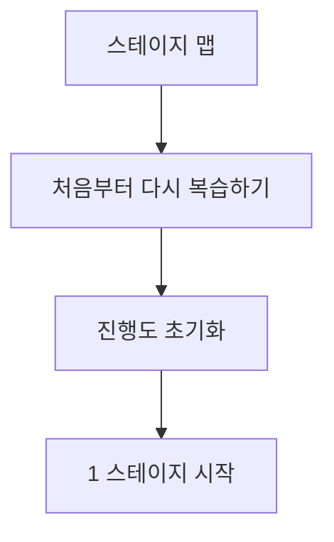
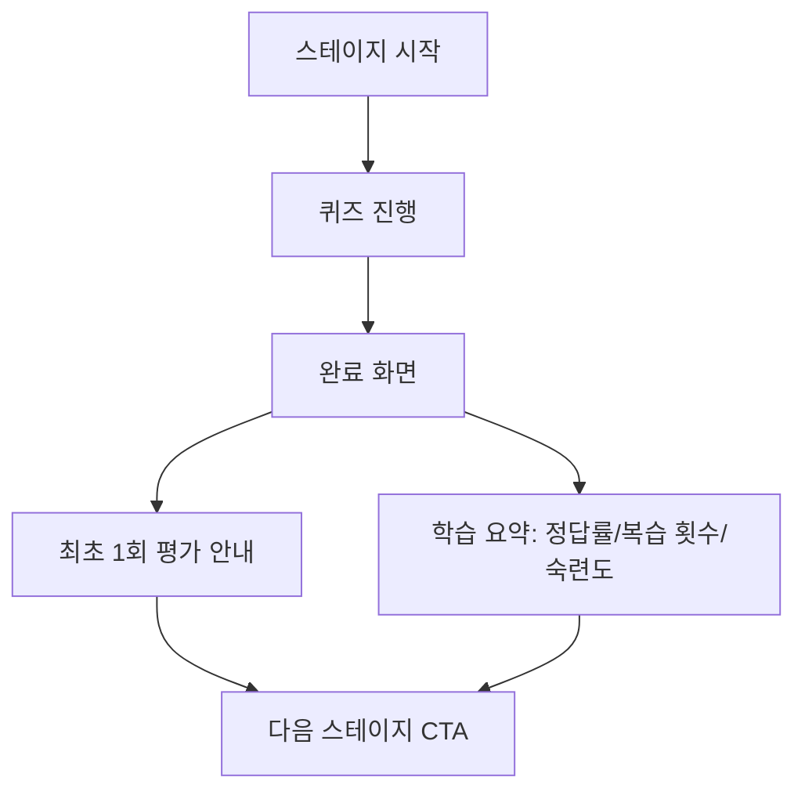
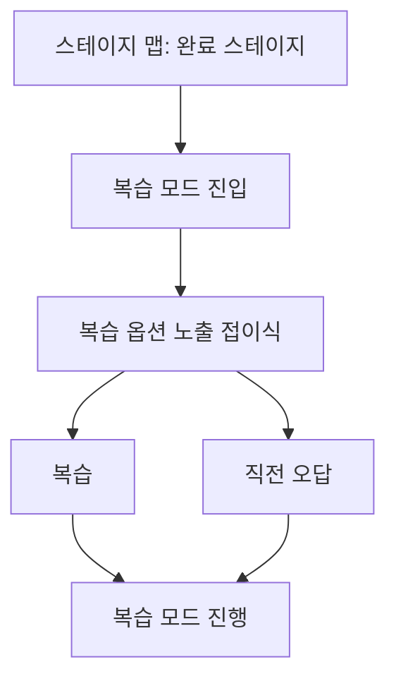
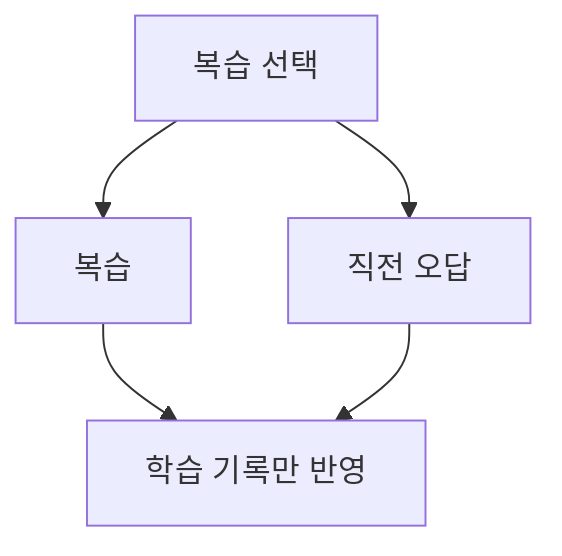

# 성경 퀴즈 UX 설계 (학습 중심)

## 개요

이 문서는 스테이지 기반 성경 퀴즈의 학습 중심 UX 구조를 정의한다.
스테이지 평가는 최초 완료 1회만 반영되며, 이후 모든 재진입은 복습이다.

## 핵심 원칙

- "재도전" 용어는 사용하지 않는다. 모든 반복은 "복습"으로 정의한다.
- 스테이지 상태는 "미완료" 또는 "완료"만 유지한다.
- 완료된 스테이지의 기본 행동은 항상 "복습하기"다.
- 복습 모드는 점수, 랭킹, 기록을 갱신하지 않는다.
- 사용자는 항상 현재가 복습인지 평가인지 명확히 인지해야 한다.
- "전체 복습"은 전체 스테이지 진행을 초기화하고 1 스테이지부터 다시 시작하는 회독 기능이다.
- "스테이지 전체 풀기"는 특정 스테이지 내 모든 문제를 처음부터 끝까지 푸는 기능이다.
- 전체 복습(회독)을 실행해도 기존 평가 기록(점수/랭킹)은 유지한다.

## 핵심 메시지

- 완료 스테이지 진입: "복습 모드입니다. 기록과 랭킹은 변경되지 않습니다."
- 복습 옵션은 학습 목적을 분명히 설명한다.

## 화면 구조

### 1) 스테이지 맵 (bible-quiz-map.html)

목표: 진행 상태를 명확히 보여주고 학습 중심 행동으로 유도한다.

구성 요소:

- 스테이지 카드 상태: 미완료 / 완료
- 학습 지표(점수 중심 대신):
    - 정답률(스테이지 누적)
    - 복습 횟수(스테이지 누적)
    - 숙련도(아이콘 또는 게이지)
- 완료 스테이지는 점수/숙련도를 함께 보여주고, 카드 클릭으로 복습 선택 화면으로 진입한다.
- 숙련도는 상태 배지와 분리된 시각 배지로 표시한다.
- 전체 복습(회독) 진입 버튼:
    - CTA: "처음부터 다시 복습하기"
    - 설명: "진행도를 초기화하고 1 스테이지부터 다시 시작합니다. 기존 기록은 유지됩니다."
    - 노출 조건: 완료된 스테이지가 1개 이상일 때만 표시
    - 위치: 스테이지 맵 상단 요약 영역 우측(총 스테이지/진행 요약 옆)

### 2) 퀴즈 진행 화면 (bible-quiz.html)

목표: 복습 여부를 상시 인지시키고 학습 분기를 제공한다.

구성 요소:
- 상단 고정 라벨 상태:
  - 최초 도전(평가 1회): "기록 중"
  - 복습: "복습 모드"
- 상단 타이틀: "Stage {N}" 형태로 현재 스테이지를 명확히 노출
- 점수 대신 학습 피드백(완료 화면):
    - 정답률(스테이지 누적)
    - 복습 횟수(스테이지 누적)
    - 숙련도(배지)

복습 선택(완료 스테이지 진입 시):

- 기본 진입: 복습 옵션 선택 화면 노출
- 복습 옵션 버튼:
    - "복습 (N문제)"
    - "직전 오답 (N문제)"
- 데이터가 없을 때는 비활성화 및 칭찬 문구 표시:
    - "직전 오답 없음 (완벽해요! ✨)"

복습 옵션 정의:

- 복습: 스테이지 내 모든 문제를 순서대로 다시 풉니다.
- 직전 오답: 바로 직전 시도에서 틀린 문제만 풉니다.
- 전체 복습(회독): 전체 진행도를 초기화하고 1 스테이지부터 다시 시작합니다.
  - 기존 평가 기록(점수/랭킹)은 유지됩니다.

## 사용자 여정

### Flow A: 전체 복습(회독) 시작

### Flow B: 최초 스테이지 완료

### Flow C: 완료 스테이지 재진입

### Flow D: 복습 분기

## 문구 전략

주요 문구:

- "복습 모드"
- "기록 중"
- "Stage {N}"
- "복습"
- "처음부터 다시 복습하기"

보조 문구:

- "복습 모드에서는 기록과 랭킹이 변경되지 않습니다."

옵션 설명 문구:

- "복습: 해당 스테이지의 모든 문제를 처음부터 끝까지 다시 풀어요."
- "직전 오답: 바로 직전 시도에서 틀린 문제만 빠르게 확인해요."
- "직전 오답 없음 (완벽해요! ✨)"
- "처음부터 다시 복습하기: 전체 진행도를 초기화하고 1 스테이지부터 다시 시작합니다. 기존 기록은 유지됩니다."

## 학습 지표 정의

- 정답률: 스테이지 누적 기준(전체 시도 대비 정답 비율)
- 복습 횟수: 스테이지 누적 복습 횟수
- 숙련도: 정답률과 복습 횟수를 반영한 단계 표시
  - 입문 / 기초 / 숙련 / 완성

## UX 목표 체크리스트

- 사용자는 완료 이후 항상 "복습 중"임을 인지한다.
- 점수보다 학습 누적과 이해도 상승이 보상으로 느껴진다.
- 어린이/초신자도 직관적으로 이해할 수 있다.
