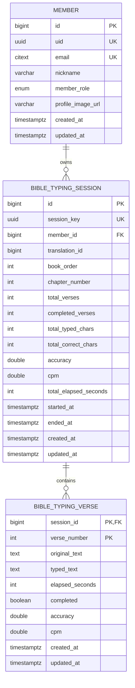

# 성경 타자 ERD

## 제약 조건

- `BIBLE_TYPING_SESSION`
  - `session_key` 유니크.
  - `(member_id, translation_id, book_order, chapter_number)` 유니크.
- `BIBLE_TYPING_VERSE`
  - `(session_id, verse_number)` 복합 PK.
