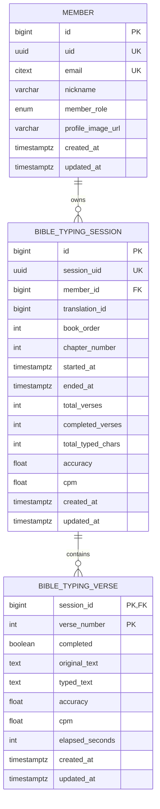

# 성경 타자 ERD

```mermaid
erDiagram
    MEMBER {
        bigint id PK
        uuid uid UK
        citext email UK
        varchar nickname
        enum member_role
        varchar profile_image_url
        timestamptz created_at
        timestamptz updated_at
    }

    BIBLE_TYPING_SESSION {
        bigint id PK
        uuid session_uid UK
        bigint member_id FK
        bigint translation_id
        int book_order
        int chapter_number
        timestamptz started_at
        timestamptz ended_at
        int total_verses
        int completed_verses
        int total_typed_chars
        float accuracy
        float cpm
        timestamptz created_at
        timestamptz updated_at
    }

    BIBLE_TYPING_VERSE {
        bigint session_id PK, FK
        int verse_number PK
        boolean completed
        text original_text
        text typed_text
        float accuracy
        float cpm
        int elapsed_seconds
        timestamptz created_at
        timestamptz updated_at
    }

    MEMBER ||--o{ BIBLE_TYPING_SESSION: owns
    BIBLE_TYPING_SESSION ||--o{ BIBLE_TYPING_VERSE: contains
```