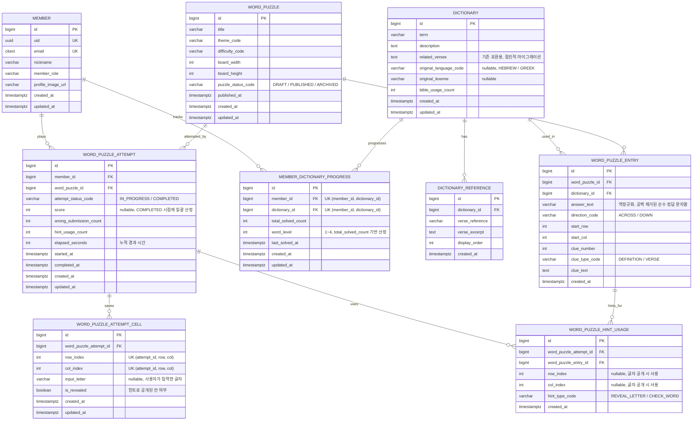

## 제약 조건

- `WORD_PUZZLE`
    - `puzzle_status_code`는 `DRAFT`, `PUBLISHED`, `ARCHIVED` 중 하나
- `WORD_PUZZLE_ENTRY`
    - `(word_puzzle_id, clue_number, direction_code)` 유니크
    - `direction_code`는 `ACROSS`, `DOWN` 중 하나
    - `clue_type_code`는 `DEFINITION`, `VERSE` 중 하나
- `WORD_PUZZLE_ATTEMPT`
    - `(member_id, word_puzzle_id, attempt_status_code = 'IN_PROGRESS')` 조합으로 진행 중인 attempt는 최대 1개
- `WORD_PUZZLE_ATTEMPT_CELL`
    - `(word_puzzle_attempt_id, row_index, col_index)` 유니크
- `WORD_PUZZLE_HINT_USAGE`
    - `hint_type_code`는 `REVEAL_LETTER`, `CHECK_WORD` 중 하나
    - `REVEAL_LETTER` 시 `row_index`, `col_index` 필수. `CHECK_WORD` 시 null
- `MEMBER_DICTIONARY_PROGRESS`
    - `(member_id, dictionary_id)` 유니크

## 퍼즐 상태 라이프사이클

```
DRAFT → PUBLISHED ↔ ARCHIVED
```

| 상태 | 설명 |
|---|---|
| `DRAFT` | 관리자가 퍼즐을 생성/편집 중. 플레이어에게 비공개 |
| `PUBLISHED` | 게시 완료. 퍼즐 목록에 노출되어 플레이 가능 |
| `ARCHIVED` | 비공개 처리. 기존 진행 중인 attempt는 유지(이어하기 가능)되나 신규 시작 불가 (신규 attempt 생성 시 서버는 `PUZZLE_NOT_AVAILABLE` 에러 반환) |

## 단어 학습 레벨 (`word_level`) 규칙

| 레벨 | 조건 (`total_solved_count`) | 설명 |
|---|---|---|
| 1 | 0 ~ 2회 | 처음 만남 |
| 2 | 3 ~ 5회 | 익숙해지는 중 |
| 3 | 6 ~ 9회 | 잘 알고 있음 |
| 4 | 10회 이상 | 완전히 습득 |

## 점수 산정 공식

| 항목 | 산정 규칙 |
|---|---|
| 기본 점수 | EASY: 500, NORMAL: 1000, HARD: 1500 |
| 힌트 감점 | 1회당 -50점 |
| 오답 제출 감점 | 1회당 -100점 |
| 시간 보너스 | 기준 시간 이내 완료 시 최대 +500점 (난이도별 기준 시간: EASY 5분, NORMAL 10분, HARD 20분). 기준 시간 초과 시 0점. 기준 시간 이내일 경우 `500 * (1 - elapsed / 기준시간)` |
| 최저 점수 | 0점 (음수 방지) |
