# 성경 가로세로 낱말 퍼즐 시퀀스 다이어그램

## 1. 퍼즐 목록 조회

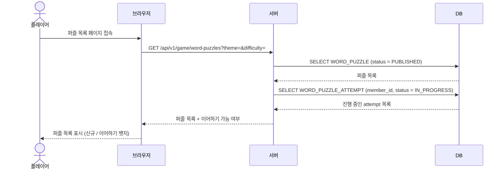

## 2. 퍼즐 시작 (신규)

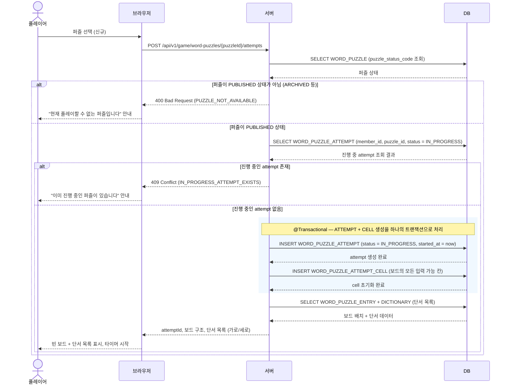

## 3. 퍼즐 이어하기

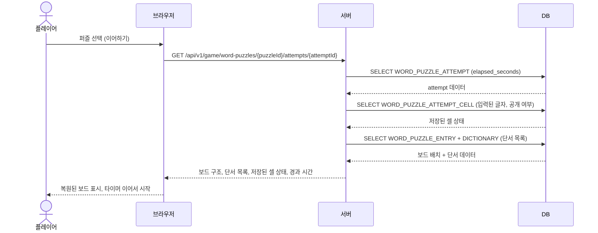

## 4. 글자 입력 및 자동 저장

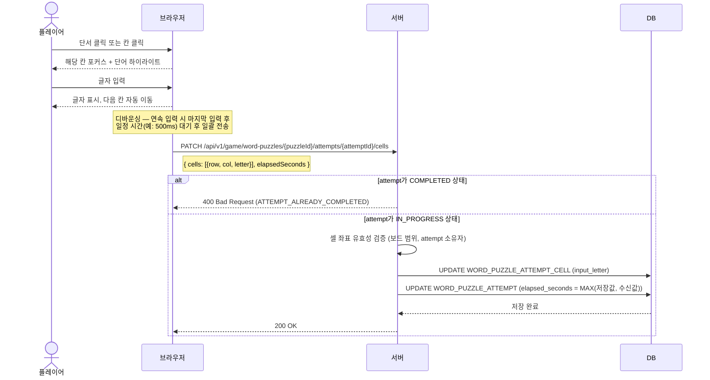

## 5. 글자 삭제 및 자동 저장

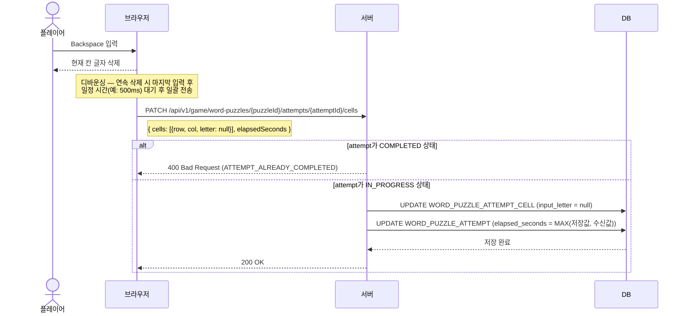

## 6. 힌트 — 글자 공개

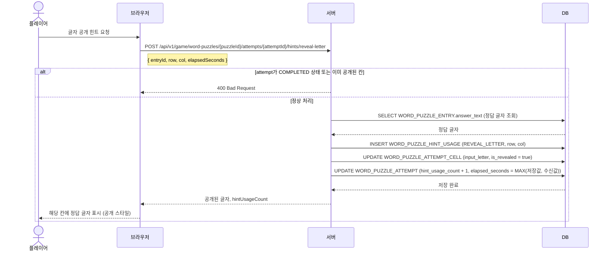

## 7. 힌트 — 단어 확인

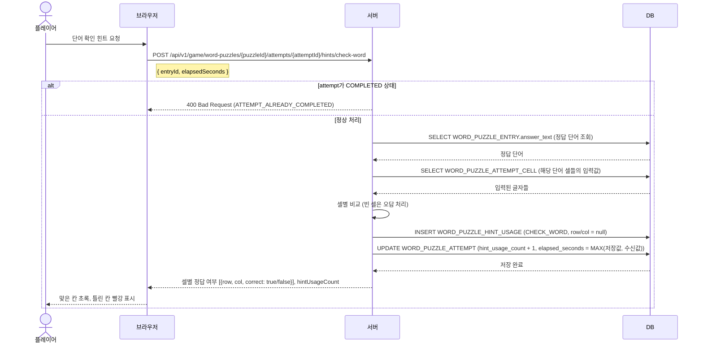

## 8. 전체 제출 — 정답

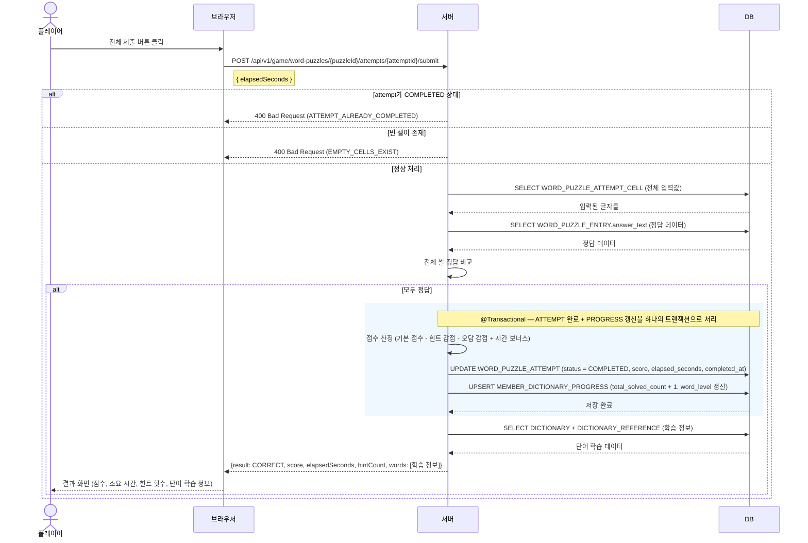

## 9. 전체 제출 — 오답

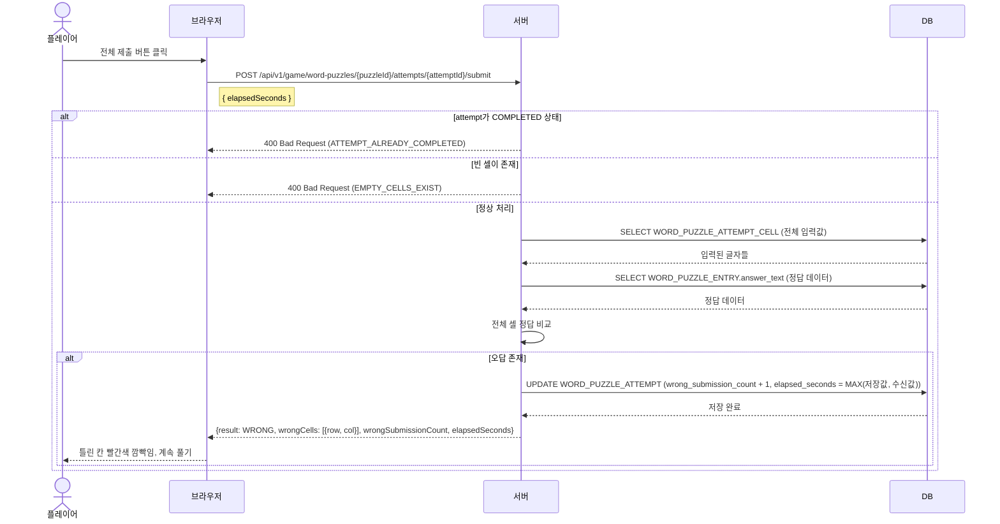

---

# 관리자 시퀀스

## A-1. 퍼즐 CRUD (등록 / 수정 / 삭제)

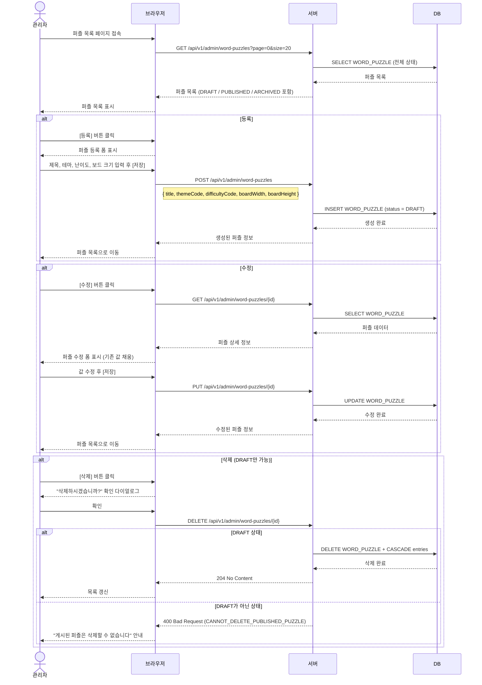

## A-2. 퍼즐 상태 전환 (게시 / 비공개)

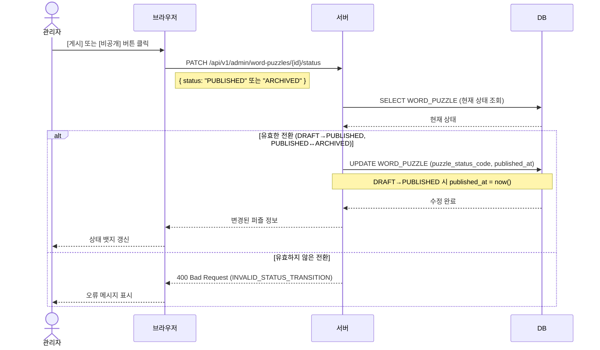

## A-3. 퍼즐 단서(Entry) CRUD

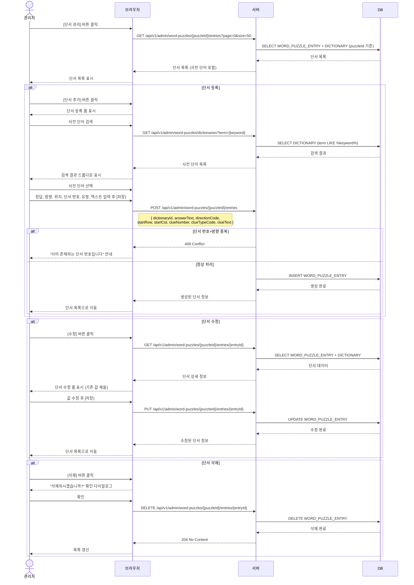
