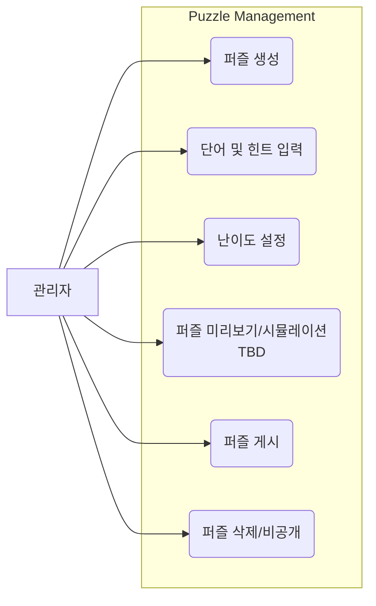
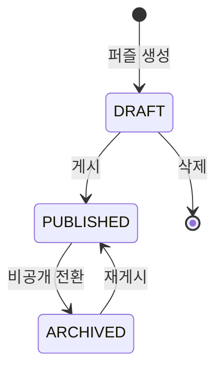
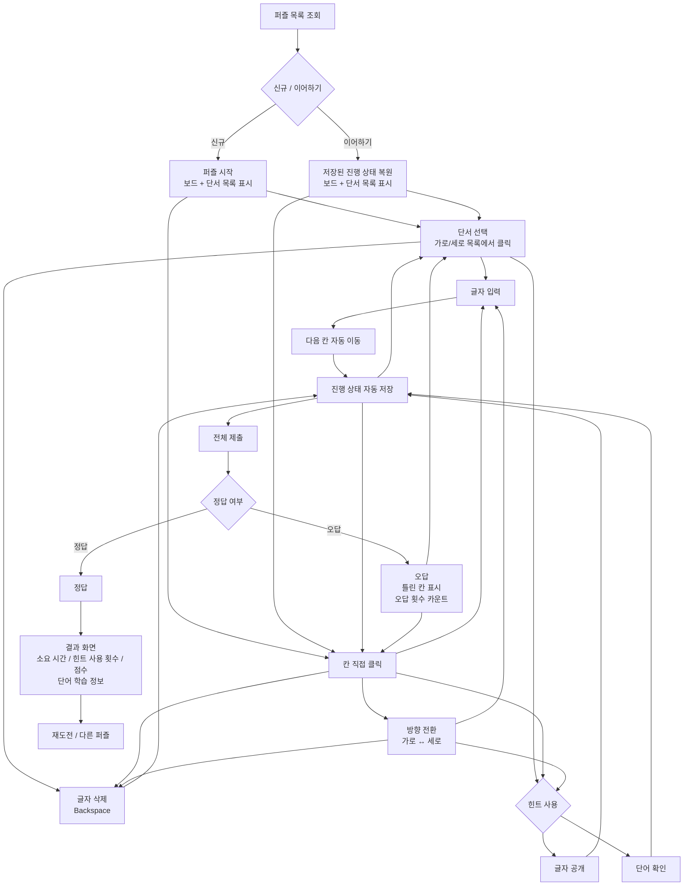

# 성경 가로세로 낱말 퍼즐 Use Case

## 관리자 유즈케이스

> 관리자 API Spec은 [bible-word-puzzle-api-spec.md](bible-word-puzzle-api-spec.md) 참고



### 관리자 퍼즐 상태 관리



| 상태 | 설명 |
|---|---|
| `DRAFT` | 관리자가 퍼즐을 생성/편집 중. 플레이어에게 비공개 |
| `PUBLISHED` | 게시 완료. 퍼즐 목록에 노출되어 플레이 가능 |
| `ARCHIVED` | 비공개 처리. 기존 진행 중인 attempt는 유지(이어하기 가능)되나 신규 시작 불가 (신규 attempt 생성 시 서버는 `PUZZLE_NOT_AVAILABLE` 에러 반환) |

## 플레이어 유즈케이스



## 플레이어 상세 흐름

### 1. 퍼즐 진입
- 퍼즐 목록에서 테마/난이도별로 퍼즐을 선택한다
- **신규 퍼즐**: 빈 보드와 가로/세로 단서 목록이 표시되고 타이머가 시작된다
- **이어하기**: 이전에 저장된 진행 상태(입력된 글자, 공개된 힌트, 경과 시간)가 복원되고 타이머가 이어서 시작된다

### 2. 단서 목록 및 유형
- 단서는 `clue_type_code`에 따라 유형이 구분된다
  - **정의형 (`DEFINITION`)**: 단어의 사전적 정의를 힌트로 제시 (예: "하나님이 세상을 만드신 행위")
  - **구절형 (`VERSE`)**: 성경 구절의 빈칸을 채우는 형태 (예: "태초에 하나님이 천지를 ____하시니라" — `DICTIONARY_REFERENCE` 활용)
- 각 단서에는 `clue_number`가 부여되며, 가로/세로로 분리되어 표시된다
- 보드 격자에 실제로 배치되는 정답 문자열은 `WORD_PUZZLE_ENTRY.answer_text`를 사용한다 (공백/특수문자가 제거된 역정규화 컬럼)

### 3. 칸 선택 및 방향 전환
- 단서 목록에서 단서를 클릭하면 해당 단어의 첫 번째 칸으로 이동하고 방향이 자동 설정된다
- 보드에서 칸을 직접 클릭하면 해당 칸이 선택된다
- 교차점 칸을 다시 클릭하거나 Space 키를 누르면 가로 ↔ 세로 방향이 전환된다
- 현재 선택된 단어의 칸들이 하이라이트 표시된다

### 4. 글자 입력 및 삭제
- 한 글자를 입력하면 자동으로 다음 칸으로 이동한다
- Backspace로 현재 칸의 글자를 삭제한다. 현재 칸이 비어있으면 이전 칸으로 이동 후 해당 칸의 글자를 삭제한다
- 방향키로 칸을 자유롭게 이동할 수 있다
- Tab으로 다음 단서의 첫 번째 칸으로 이동, Shift+Tab으로 이전 단서로 이동한다
- 한글 조합 입력(IME)은 `compositionend` 이벤트 기준으로 완성된 글자만 확정한다

### 5. 자동 저장
- 글자 입력, 글자 삭제, 힌트 사용 시마다 현재 보드 상태가 자동 저장된다
- 저장 대상: 각 셀의 입력된 글자, 경과 시간 (`WORD_PUZZLE_ATTEMPT_CELL`, `WORD_PUZZLE_ATTEMPT.elapsed_seconds`)
- 브라우저를 닫거나 이탈해도 진행 상태가 유지된다
- 네트워크 실패 시 재연결 후 자동 재시도한다

### 6. 힌트 사용
- 칸이나 단서를 선택한 상태에서 힌트를 사용할 수 있다
- **글자 공개**: 선택한 칸의 정답 글자를 공개한다 (힌트 사용 횟수 카운트, 해당 셀의 `row_index`/`col_index` 기록)
- **단어 확인**: 현재 단어의 입력된 글자가 맞는지 확인한다 (맞으면 초록, 틀리면 빨강 표시, 빈 셀은 오답 처리. `word_puzzle_entry_id`만 기록하며 `row_index`/`col_index`는 null)

### 7. 전체 제출 및 결과
- 모든 칸을 채운 뒤 전체 제출 버튼을 누른다
- 빈 칸이 존재하면 제출 불가 (클라이언트: 버튼 비활성화, 서버: `EMPTY_CELLS_EXIST` 에러)
- **정답**: 결과 화면으로 이동
- **오답**: 틀린 칸을 표시하고 계속 풀 수 있다 (오답 제출 횟수가 카운트된다)

### 8. 점수 산정

점수는 퍼즐 완료(COMPLETED) 시점에 일괄 산정한다 (진행 중에는 `score = null`).

| 항목 | 산정 규칙 |
|---|---|
| 기본 점수 | EASY: 500, NORMAL: 1000, HARD: 1500 |
| 힌트 감점 | 1회당 -50점 |
| 오답 제출 감점 | 1회당 -100점 |
| 시간 보너스 | 기준 시간 이내 완료 시 최대 +500점. 기준 시간: EASY 5분, NORMAL 10분, HARD 20분. 산정: `500 * (1 - elapsed / 기준시간)`. 기준 시간 초과 시 0점 |
| 최저 점수 | 0점 (음수 방지) |

**산정 공식:**

```
최종 점수 = MAX(0, 기본 점수 - (힌트 횟수 × 50) - (오답 횟수 × 100) + 시간 보너스)
```

### 9. 퍼즐 완료 후
- 결과 화면에서 점수, 소요 시간, 힌트 사용 횟수를 확인한다
- 풀었던 단어들의 학습 정보를 확인할 수 있다 (사전적 정의, 원어, 성경 구절 참조 — `DICTIONARY`, `DICTIONARY_REFERENCE` 활용)
- 재도전하거나 다른 퍼즐로 이동한다
- 풀었던 단어들의 학습 진행도(`MEMBER_DICTIONARY_PROGRESS`)가 갱신된다

### 10. 단어 학습 레벨 (`word_level`)

퍼즐을 통해 같은 단어를 반복해서 풀면 학습 레벨이 상승한다.

| 레벨 | 조건 (`total_solved_count`) | 설명 |
|---|---|---|
| 1 | 0 ~ 2회 | 처음 만남 |
| 2 | 3 ~ 5회 | 익숙해지는 중 |
| 3 | 6 ~ 9회 | 잘 알고 있음 |
| 4 | 10회 이상 | 완전히 습득 |
