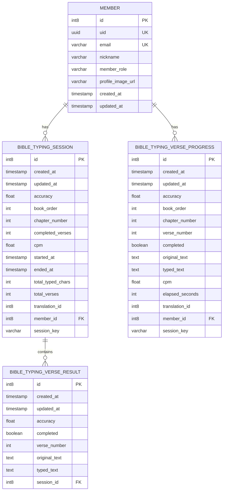
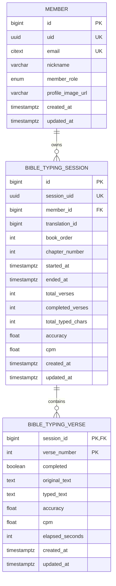

# DB 테이블 구조 변경 작업 문서

## 1. 작업 배경

현재 성경 타자 서비스의 DB 구조는 기능 구현은 가능하지만,
세션–절–회원 간 관계가 **문자열 키(session_key)** 및 **중복 컬럼**에 의존하고 있어 다음과 같은 문제가 누적되고 있습니다.

* DB 레벨에서 데이터 무결성을 보장할 수 없음
* 중복 데이터로 인한 정합성 불일치 가능성
* 불필요한 테이블 증가로 인한 복잡도 상승
* 장기 운영 및 확장 시 유지보수 비용 증가

이에 따라, **도메인 책임을 명확히 하고 Aggregate 기준으로 재정렬한 구조**로 변경합니다.

---

## 2. AS-IS 구조

### 문제 있는 현재 ERD

---

## 3. AS-IS 구조의 핵심 문제점

### 3.1 문자열 기반 관계 (`session_key`) 사용

* `session_key`는 FK가 아니므로 DB 무결성 보장 불가
* 오타, 중복, 삭제 불일치 발생 가능
* 인덱스 및 조인 성능 저하

➡ **관계는 반드시 숫자 기반 FK로 표현해야 함**

---

### 3.2 동일 개념의 중복 저장

| 개념           | Session | VerseProgress | VerseResult |
|--------------|---------|---------------|-------------|
| accuracy     | O       | O             | O           |
| typed_text   | ❌       | O             | O           |
| verse_number | ❌       | O             | O           |

* 동일 데이터가 여러 테이블에 존재
* 수정/생성 시점 차이로 정합성 깨질 위험

---

### 3.3 도메인 책임 불명확

* VerseProgress / VerseResult의 역할이 중복
* “진행 중”과 “결과”가 테이블로만 분리되어 있음
* Aggregate 기준이 불명확하여 트랜잭션 경계 모호

---

### 3.4 FK 설계의 일관성 부족

* VerseProgress가 Session이 아닌 Member에 직접 종속
* 상위 개념(translation, book/chapter)이 여러 테이블에 흩어짐

---

## 4. TO-BE 구조 설계 방향

### 설계 원칙

1. **Session을 Aggregate Root로 정의**
2. 하위 엔티티는 반드시 Session에 종속
3. 중복 테이블 제거
4. 숫자 기반 FK로 무결성 강제
5. 상태는 컬럼으로 표현하고 테이블은 최소화

---

## 5. TO-BE 구조

### 개선된 ERD

---

## 6. TO-BE 구조 변경 이유 (핵심)

### 6.1 `BIBLE_TYPING_VERSE_RESULT` 제거

* `completed = true` 상태의 Verse가 곧 결과
* Session 종료 후 Verse 수정 금지로 결과 스냅샷 보장
* 이중 저장 제거 → 정합성 사고 방지

---

### 6.2 `BIBLE_TYPING_VERSE_PROGRESS` → `BIBLE_TYPING_VERSE` 통합

* 진행/결과를 테이블이 아닌 **상태로 표현**
* 테이블 수 감소 → 구조 단순화
* `(session_id, verse_number)` 복합 PK로 중복 방지

---

### 6.3 `session_key` 제거 → `session_id`, `session_uid` 분리

* 내부 무결성: `session_id (BIGINT FK)`
* 외부 노출: `session_uid (UUID)`
* 역할 분리로 성능과 안정성 동시 확보

---

### 6.4 상위 개념의 단일화

* `member_id`, `translation_id`, `book/chapter`는 Session에만 존재
* 하위 엔티티는 상위를 신뢰
* 구조적 정합성 확보

---

## 7. 기대 효과

| 항목      | 개선 효과          |
|---------|----------------|
| 무결성     | DB 레벨에서 강제     |
| 성능      | FK 조인 + 단순 인덱스 |
| 유지보수    | 테이블 수 감소       |
| 확장성     | 통계/이력 확장 용이    |
| DDD 적합성 | Aggregate 명확   |

---

## 8. 결론

이번 구조 변경은 단순 리팩터링이 아니라,

> **“데이터가 우연히 맞아떨어지는 구조”에서
> “구조적으로 틀릴 수 없는 설계”로의 전환**

입니다.

현재 시점에서 변경하지 않으면, 트래픽 증가·기능 확장 시 **반드시 운영 리스크로 돌아옵니다.**

---