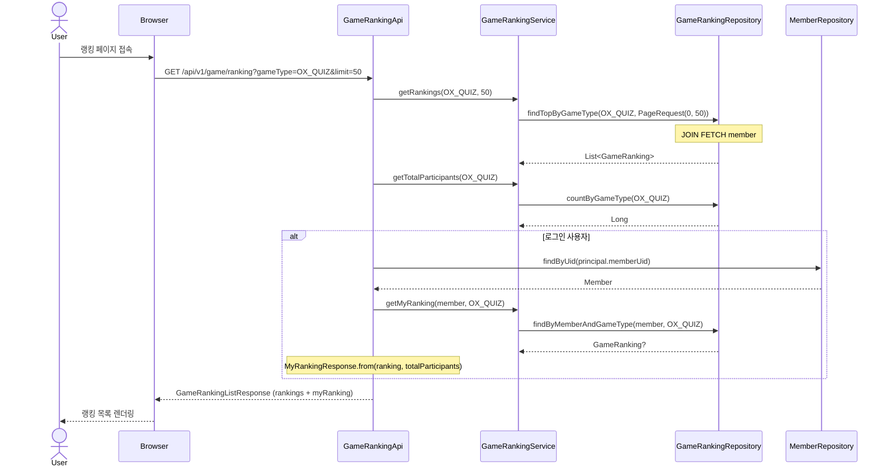
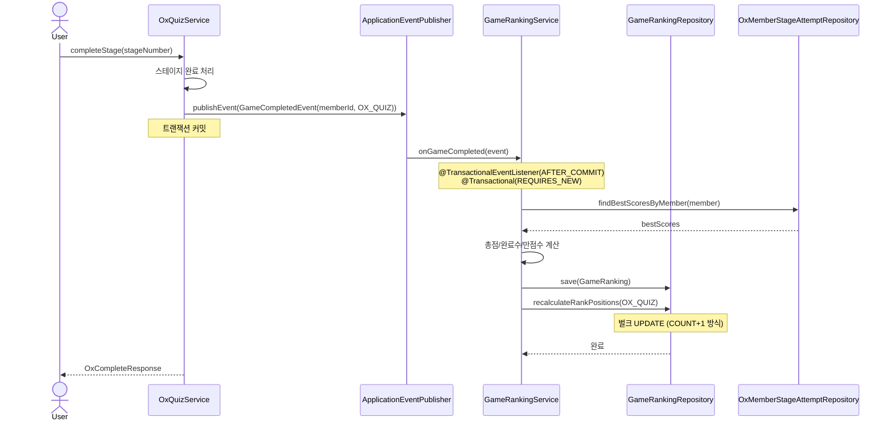

# 게임 점수 랭킹(순위) 조회 기능 설계문서

## 구현 완료 상태

모든 기능 구현 완료. 이 문서는 최종 구현 결과를 정리한 설계 문서이다.

---

## 1. 개요

ElSeeker 게임 모듈의 **점수 기반 랭킹(순위) 조회 기능**.
사용자는 자신의 순위와 상위 랭커를 확인하며, 게임 참여 동기를 높인다.

### 1.1 대상 게임

| 게임 | 점수 기준 | 최대 점수 | 원본 테이블 |
|------|-----------|-----------|-------------|
| O/X 퀴즈 | 스테이지별 최고 점수 합산 | 660점 (66스테이지 × 10점) | `ox_quiz_member_stage_attempt` |
| 객관식 퀴즈 | 스테이지별 최고 점수 합산 (RECORD 모드만) | 100점 (10스테이지 × 10점) | `quiz_member_stage_attempt` |
| 단어 퍼즐 | 퍼즐별 최고 점수 합산 | 가변 (퍼즐 수 × 최대 2,000점) | `word_puzzle_attempt` |
| 성경 타이핑 | 정확도×CPM 보정 + 완료/만점 보너스 | 가변 (참여량에 비례) | `bible_typing_verse` |

### 1.2 용어 정의

| 용어 | 설명 |
|------|------|
| 랭킹 점수 (ranking_score) | 게임별 산출 공식에 따라 계산된 종합 점수 |
| 순위 (ranking_position) | 랭킹 점수 기준 내림차순 정렬 시 위치 (동점 시 타이브레이커 적용) |

---

## 2. 현재 게임 점수 구조 분석

### 2.1 O/X 퀴즈

```
게임 흐름: 스테이지 선택 → 10문제 풀기 → 점수 기록
```

**핵심 엔티티:**
- `OxMemberStageAttempt`: 사용자의 스테이지 시도 기록
  - `member_id`, `stage_number`, `score` (0~10), `completed_at`
- 스테이지 재도전 가능 → 최고 점수(best score)만 랭킹에 반영

**랭킹 점수 산출:**
```sql
SELECT member_id,
       SUM(best_score) AS ranking_score,
       COUNT(*) AS completed_stages
FROM (
    SELECT member_id, stage_number, MAX(score) AS best_score
    FROM ox_quiz_member_stage_attempt
    WHERE completed_at IS NOT NULL
    GROUP BY member_id, stage_number
) sub
GROUP BY member_id
ORDER BY ranking_score DESC;
```

### 2.2 객관식 퀴즈

```
게임 흐름: 스테이지 선택 → 객관식 문제 풀기 → 점수 기록
```

**핵심 엔티티:**
- `QuizMemberStageAttempt` (테이블: `quiz_member_stage_attempt`): 사용자의 스테이지 시도 기록
  - `member_id`, `stage_number`, `score` (0~10), `mode` (RECORD/REVIEW), `completed_at`
- RECORD 모드만 랭킹에 반영 (REVIEW 모드는 학습용, 점수 미반영)

**랭킹 점수 산출:**
```sql
SELECT member_id,
       SUM(best_score) AS ranking_score,
       COUNT(*) AS completed_stages
FROM (
    SELECT member_id, stage_number, MAX(score) AS best_score
    FROM quiz_member_stage_attempt
    WHERE completed_at IS NOT NULL AND mode = 'RECORD'
    GROUP BY member_id, stage_number
) sub
GROUP BY member_id
ORDER BY ranking_score DESC;
```

### 2.3 단어 퍼즐

```
게임 흐름: 퍼즐 선택 → 십자말풀이 → 점수 계산 (기본점수 - 감점 + 시간보너스)
```

**핵심 엔티티:**
- `WordPuzzleAttempt` (테이블: `word_puzzle_attempt`): 퍼즐 시도 기록
  - `member_id`, `word_puzzle_id`, `score` (계산식 기반), `attempt_status_code` (IN_PROGRESS/COMPLETED)
  - `hint_usage_count`, `wrong_submission_count`, `elapsed_seconds`

**점수 계산 공식:**
```
score = MAX(0, 기본점수 - (힌트 사용 × 50) - (오답 제출 × 100) + 시간보너스)
시간보너스 = 제한시간 내 완료 시 500 × (1 - 소요시간/제한시간), 초과 시 0
```

| 난이도 | 기본 점수 | 제한 시간 | 최대 점수 |
|--------|-----------|-----------|-----------|
| EASY | 500 | 300초 (5분) | 1,000 |
| NORMAL | 1,000 | 600초 (10분) | 1,500 |
| HARD | 1,500 | 1,200초 (20분) | 2,000 |

**랭킹 점수 산출:**
```sql
SELECT member_id,
       SUM(best_score) AS ranking_score,
       COUNT(*) AS completed_puzzles
FROM (
    SELECT member_id, word_puzzle_id, MAX(score) AS best_score
    FROM word_puzzle_attempt
    WHERE attempt_status_code = 'COMPLETED' AND score IS NOT NULL
    GROUP BY member_id, word_puzzle_id
) sub
GROUP BY member_id
ORDER BY ranking_score DESC;
```

### 2.4 성경 타이핑

```
게임 흐름: 장/절 선택 → 타이핑 → 정확도/속도 기록
```

**핵심 엔티티:**
- `BibleTypingVerse`: 절별 타이핑 결과 (복합 PK: `session_id` + `verse_number`)
  - `accuracy: Double` (0.0~100.0), `cpm` (분당 타자수), `completed: Boolean`
- `BibleTypingSession`: 타이핑 세션
  - `member_id`, `translation_id`, `book_order`, `chapter_number`

**랭킹 점수 산출:**

> **변경 예정**: 현재는 `AVG(accuracy)`만 사용. CPM + 완료/만점 보너스 반영 예정 (9.4절 참고).

```sql
-- 현재 구현
SELECT s.member_id,
       ROUND(AVG(v.accuracy), 2) AS avg_accuracy,
       COUNT(*) AS completed_verses
FROM bible_typing_verse v
JOIN bible_typing_session s ON v.session_id = s.id
WHERE v.completed = true
GROUP BY s.member_id
ORDER BY avg_accuracy DESC;

-- 변경 예정: AVG(cpm) 추가 조회
SELECT s.member_id,
       ROUND(AVG(v.accuracy), 2) AS avg_accuracy,
       ROUND(AVG(v.cpm), 2) AS avg_cpm,
       COUNT(*) AS completed_count,
       COUNT(*) FILTER (WHERE v.accuracy = 100.0) AS perfect_count
FROM bible_typing_verse v
JOIN bible_typing_session s ON v.session_id = s.id
WHERE v.completed = true
GROUP BY s.member_id;
-- ranking_score = avg_accuracy × (1 + avg_cpm / 1000) + completed_count × 0.2 + perfect_count × 0.5
```

---

## 3. 기능 요구사항

### 3.1 기능 목록

| ID | 기능 | 설명 | 상태 |
|----|------|------|------|
| R-01 | 게임별 랭킹 목록 조회 | 4개 게임 각각의 상위 N명 랭킹 | 완료 |
| R-02 | 내 순위 조회 | 로그인 사용자의 현재 순위와 점수 | 완료 |
| R-03 | 랭킹 페이지 | 게임별 탭으로 전환 가능한 랭킹 UI | 완료 |
| R-04 | 랭킹 캐시 | 빈번한 조회 대비 캐시 적용 | 미구현 (P1) |
| R-05 | 시즌별 랭킹 | 기간별 랭킹 분리 | 미구현 (P2) |

### 3.2 비기능 요구사항

- 랭킹 조회 응답 시간: 500ms 이내
- 동시 접속 100명 기준 안정적 처리
- 랭킹은 실시간이 아닌 **준실시간** (게임 완료 시 이벤트 기반 갱신)

---

## 4. ERD


### 4.1 GAME_RANKING 테이블 설계

| 컬럼 | 타입 | 설명 | 제약조건 |
|------|------|------|----------|
| `id` | BIGINT | PK | AUTO_INCREMENT |
| `member_id` | BIGINT | 사용자 FK | NOT NULL, FK(member) |
| `game_type` | VARCHAR(20) | 게임 유형 | NOT NULL, ENUM(OX_QUIZ, MULTIPLE_CHOICE, WORD_PUZZLE, TYPING) |
| `ranking_score` | DECIMAL(7,2) | 랭킹 점수 — Kotlin: `BigDecimal` | NOT NULL, DEFAULT 0 |
| `completed_count` | INT | 완료 스테이지/절 수 | NOT NULL, DEFAULT 0 |
| `perfect_count` | INT | 만점 스테이지/절 수 | NOT NULL, DEFAULT 0 |
| `ranking_position` | INT | 순위 (`rank`는 PostgreSQL 예약어이므로 회피) | NOT NULL, DEFAULT 0 |
| `calculated_at` | TIMESTAMP | 마지막 계산 시각 | NOT NULL |
| `created_at` | TIMESTAMP | 생성일 | NOT NULL |
| `updated_at` | TIMESTAMP | 수정일 | NOT NULL |

**인덱스:**
```sql
UNIQUE INDEX UK_game_ranking_member_type ON game_ranking (member_id, game_type);
INDEX IDX_game_ranking_type_rank ON game_ranking (game_type, ranking_position);
INDEX IDX_game_ranking_type_score ON game_ranking (game_type, ranking_score DESC);
```

### 4.2 설계 결정: 별도 테이블 vs 실시간 집계

| 방식 | 장점 | 단점 |
|------|------|------|
| **별도 테이블 (채택)** | 빠른 조회, 인덱스 최적화 용이, 순위 미리 계산 | 데이터 동기화 필요 |
| 실시간 집계 | 항상 최신 데이터 | 복잡한 쿼리, 사용자 증가 시 성능 저하 |

→ `GAME_RANKING` 테이블에 미리 계산된 점수와 순위를 저장하고, 게임 완료 이벤트 발생 시 갱신한다.

### 4.3 성능 고려사항: 순위 재계산 전략

현재 설계는 게임 완료 이벤트 수신 시 `recalculateRankPositions()`로 해당 게임 타입의 **전체 행**을 `COUNT(*) + 1` 서브쿼리로 갱신한다.
현재 규모(~100명 동시 접속)에서는 문제없으나, 1,000명 이상 활성 사용자 시 쓰기 병목이 될 수 있다.

**대안 (향후 필요 시):**
- **주기적 배치**: 5분마다 스케줄러로 순위 재계산 (준실시간 허용 시)
- **온디맨드 순위**: `COUNT(*) WHERE ranking_score > :myScore` 로 조회 시 계산 (ranking_position 컬럼 불필요)

---

## 5. API 설계

### 5.1 엔드포인트

| Method | Path | 설명 | 인증 |
|--------|------|------|------|
| GET | `/api/v1/game/ranking` | 게임별 랭킹 목록 조회 | 선택 (비로그인 시 myRanking null) |
| GET | `/api/v1/game/ranking/me` | 내 순위 조회 | 필수 |

### 5.2 랭킹 목록 조회

```
GET /api/v1/game/ranking?gameType=OX_QUIZ&limit=50
```

**Query Parameters:**

| 파라미터 | 타입 | 필수 | 기본값 | 설명 |
|----------|------|------|--------|------|
| `gameType` | String | Y | - | `OX_QUIZ`, `MULTIPLE_CHOICE`, `WORD_PUZZLE`, `TYPING` |
| `limit` | Int | N | 50 | 조회 인원 수 (1~100, `coerceIn`으로 범위 제한) |

**Response — `GameRankingListResponse`:**
```json
{
  "gameType": "OX_QUIZ",
  "totalParticipants": 234,
  "rankings": [
    {
      "rank": 1,
      "nickname": "성경마스터",
      "profileImageUrl": "/images/default-profile.png",
      "rankingScore": 580.00,
      "completedCount": 62,
      "perfectCount": 45
    }
  ],
  "myRanking": {
    "rank": 15,
    "rankingScore": 320.00,
    "completedCount": 40,
    "perfectCount": 12,
    "topPercent": 6.4
  }
}
```

> `myRanking`은 로그인 사용자에게만 포함된다. 비로그인 시 `null`.
> `topPercent`는 `rankingPosition * 100.0 / totalParticipants`로 산출 (소수점 1자리).

### 5.3 내 순위 조회

```
GET /api/v1/game/ranking/me?gameType=OX_QUIZ
```

**Response — `MyRankingDetailResponse`:**
```json
{
  "gameType": "OX_QUIZ",
  "rank": 15,
  "totalParticipants": 234,
  "rankingScore": 320.00,
  "completedCount": 40,
  "perfectCount": 12,
  "topPercent": 6.4
}
```

> 랭킹 데이터가 없으면 `404 Not Found`.

---

## 6. 백엔드 구조 (Hexagonal Architecture)

```
game/
  adapter/input/api/client/
    GameRankingApi.kt              -- @RestController
    GameRankingApiDocument.kt      -- Swagger 문서 인터페이스
    response/
      GameRankingResponses.kt      -- GameRankingListResponse, GameRankingItemResponse,
                                      MyRankingResponse, MyRankingDetailResponse
  adapter/input/web/client/
    GameWebController.kt           -- 랭킹 페이지 뷰 (기존 컨트롤러에 추가)
  adapter/output/jpa/
    GameRankingRepository.kt       -- Spring Data JPA + 커스텀 순위 갱신 쿼리
  application/service/
    GameRankingService.kt          -- 랭킹 조회 + 이벤트 기반 갱신
  domain/model/
    GameRanking.kt                 -- @Entity (updateScore 메서드 포함)
  domain/vo/
    GameType.kt                    -- enum (OX_QUIZ, MULTIPLE_CHOICE, WORD_PUZZLE, TYPING)
  domain/event/
    GameCompletedEvent.kt          -- 게임 완료 이벤트 (memberId, gameType)
```

### 6.1 핵심 클래스

**GameRanking.kt (Entity)**
```kotlin
@Entity
@Table(
    name = "game_ranking",
    uniqueConstraints = [UniqueConstraint(columnNames = ["member_id", "game_type"])],
    indexes = [
        Index(columnList = "game_type, ranking_position"),
        Index(columnList = "game_type, ranking_score DESC")
    ]
)
class GameRanking(
    id: Long? = null,
    @ManyToOne(fetch = FetchType.LAZY)
    @JoinColumn(name = "member_id", nullable = false)
    val member: Member,
    @Enumerated(EnumType.STRING)
    @Column(name = "game_type", nullable = false, length = 20)
    val gameType: GameType,
    @Column(name = "ranking_score", nullable = false, precision = 7, scale = 2)
    var rankingScore: BigDecimal = BigDecimal.ZERO,
    @Column(name = "completed_count", nullable = false)
    var completedCount: Int = 0,
    @Column(name = "perfect_count", nullable = false)
    var perfectCount: Int = 0,
    @Column(name = "ranking_position", nullable = false)
    var rankingPosition: Int = 0,
    @Column(name = "calculated_at", nullable = false)
    var calculatedAt: Instant = Instant.now()
) : BaseTimeEntity(id = id) {

    fun updateScore(rankingScore: BigDecimal, completedCount: Int, perfectCount: Int) {
        this.rankingScore = rankingScore
        this.completedCount = completedCount
        this.perfectCount = perfectCount
        this.calculatedAt = Instant.now()
    }
}
```

**GameCompletedEvent.kt (Domain Event)**
```kotlin
data class GameCompletedEvent(
    val memberId: Long,
    val gameType: GameType
)
```

**GameRankingService.kt (핵심 로직)**
```kotlin
@Service
class GameRankingService(
    private val gameRankingRepository: GameRankingRepository,
    private val memberRepository: MemberRepository,
    private val oxStageAttemptRepository: OxMemberStageAttemptRepository,
    private val quizStageAttemptRepository: QuizStageAttemptRepository,
    private val wordPuzzleAttemptRepository: WordPuzzleAttemptRepository,
    private val typingVerseRepository: BibleTypingVerseRepository
) {
    /** 게임 완료 이벤트 수신 — AFTER_COMMIT 단계에서 새 트랜잭션으로 처리 */
    @TransactionalEventListener(phase = TransactionPhase.AFTER_COMMIT)
    @Transactional(propagation = Propagation.REQUIRES_NEW)
    fun onGameCompleted(event: GameCompletedEvent) { ... }

    /** 해당 사용자의 랭킹 점수 재계산 (private) */
    private fun recalculate(member: Member, gameType: GameType) { ... }

    /** 랭킹 목록 조회 */
    @Transactional(readOnly = true)
    fun getRankings(gameType: GameType, limit: Int): List<GameRanking> { ... }

    /** 내 순위 조회 */
    @Transactional(readOnly = true)
    fun getMyRanking(member: Member, gameType: GameType): GameRanking? { ... }

    /** 총 참여자 수 조회 */
    @Transactional(readOnly = true)
    fun getTotalParticipants(gameType: GameType): Long { ... }
}
```

### 6.2 랭킹 갱신 아키텍처 — Spring Event 기반

```
사용자가 게임 완료
    ↓
각 게임 서비스가 완료 처리 후 ApplicationEventPublisher로 이벤트 발행:
  - OxQuizService.completeStage()          → 스테이지 완료 후 발행
  - BibleQuizService.completeStage()       → 스테이지 완료 후 발행
  - WordPuzzleService.submit()             → attempt.complete(score) 후 발행
  - BibleTypingSessionService.saveVerseProgress() → request.completed=true인 경우만 발행
    ↓
GameRankingService.onGameCompleted() 수신
  (@TransactionalEventListener, phase = AFTER_COMMIT)
  (@Transactional, propagation = REQUIRES_NEW)
    ↓
memberRepository.getReferenceById(event.memberId)
    ↓
recalculate(member, gameType)
  → 게임별 점수 재계산 (SUM/AVG 집계)
  → gameRankingRepository.save(ranking)
  → gameRankingRepository.recalculateRankPositions(gameType)
```

**설계 결정: 직접 호출 vs 이벤트 기반**

| 방식 | 장점 | 단점 |
|------|------|------|
| 직접 호출 | 단순, 추적 용이 | 게임 서비스 → 랭킹 서비스 강결합 |
| **이벤트 기반 (채택)** | 느슨한 결합, 게임 서비스 독립성 유지 | 비동기 특성으로 즉시 반영 안 됨 (AFTER_COMMIT) |

> `AFTER_COMMIT` + `REQUIRES_NEW`: 게임 완료 트랜잭션이 커밋된 후 새 트랜잭션에서 랭킹을 갱신한다.
> 랭킹 갱신 실패가 게임 완료 트랜잭션에 영향을 주지 않는다 (실패 시 로그만 남김).

### 6.3 순위 계산 쿼리

```sql
-- COUNT + 1 방식 (동점 시 동일 순위 아닌, 상위 인원 수 + 1)
UPDATE game_ranking gr
SET ranking_position = (
    SELECT COUNT(gr2) + 1 FROM game_ranking gr2
    WHERE gr2.game_type = gr.game_type
    AND (
        gr2.ranking_score > gr.ranking_score
        OR (gr2.ranking_score = gr.ranking_score AND gr2.perfect_count > gr.perfect_count)
        OR (gr2.ranking_score = gr.ranking_score AND gr2.perfect_count = gr.perfect_count
            AND gr2.completed_count > gr.completed_count)
        OR (gr2.ranking_score = gr.ranking_score AND gr2.perfect_count = gr.perfect_count
            AND gr2.completed_count = gr.completed_count AND gr2.calculated_at < gr.calculated_at)
    )
)
WHERE gr.game_type = :gameType
```

> JPQL `@Modifying` 쿼리로 구현. `flushAutomatically = true`, `clearAutomatically = true` 설정.

### 6.4 GameRankingRepository

```kotlin
interface GameRankingRepository : JpaRepository<GameRanking, Long> {
    fun findTopByGameType(gameType: GameType, pageable: Pageable): List<GameRanking>  // JOIN FETCH member
    fun findByMemberAndGameType(member: Member, gameType: GameType): GameRanking?     // JOIN FETCH member
    fun countByGameType(gameType: GameType): Long
    fun recalculateRankPositions(gameType: GameType)  // @Modifying 벌크 UPDATE
    fun deleteAllByMemberId(memberId: Long)           // 회원 탈퇴 시 정리
}
```

---

## 7. 프론트엔드

### 7.1 파일 구조

```
templates/game/
  game-ranking.html              -- 랭킹 페이지 템플릿

static/css/game/
  game-ranking.css               -- 랭킹 페이지 스타일

static/js/game/
  game-ranking.js                -- 탭 전환, API 호출, 렌더링
```

### 7.2 UI 구조

```
┌─────────────────────────────────────┐
│  게임 랭킹                           │
├─────────────────────────────────────┤
│  [O/X] [객관식] [퍼즐] [타이핑]        │  ← 탭 전환 (URL ?gameType= 연동)
├─────────────────────────────────────┤
│  내 순위: 15위 / 234명 (상위 6.4%)    │  ← 로그인 시 표시
│     총점: 320점                      │
├─────────────────────────────────────┤
│  순위  닉네임           점수          │
│  ─────────────────────────────────  │
│  🥇 1  성경마스터        580          │
│  🥈 2  말씀사모          540          │
│  🥉 3  은혜받은자        520          │
│     4  기쁨의노래        490          │
│     5  감사합니다        480          │
│    ...                              │
│    15  나 ←(하이라이트)   320          │
│    ...                              │
└─────────────────────────────────────┘
```

### 7.3 주요 동작

- **탭 전환**: 게임 타입별 탭 클릭 시 API 재호출, URL 파라미터로 초기 탭 설정 가능
- **비로그인 처리**: `fetchWithAuthRetry` 실패 시 일반 `fetch`로 재시도 (공개 API)
- **점수 포맷**: 정수면 소수점 없이, 소수면 소수점 2자리 (`formatScore`)
- **내 순위 하이라이트**: 랭킹 목록에서 본인 행에 `.is-me` 클래스 적용

### 7.4 반응형 설계

| 화면 | 레이아웃 |
|------|----------|
| 모바일 (≤576px) | 카드형 리스트, 닉네임 축약, 점수만 표시 |
| 태블릿 (577~991px) | 테이블형, 전체 컬럼 표시 |
| 데스크톱 (≥992px) | 테이블형, max-width 제한, 중앙 정렬 |

### 7.5 SEO

- `pageDescription`: 게임별 랭킹 설명
- `pageKeywords`: 성경 게임 랭킹 관련 키워드
- 공개 페이지 (비로그인 조회 가능)

---

## 8. 시퀀스 다이어그램

### 8.1 랭킹 조회



### 8.2 랭킹 갱신 (게임 완료 시 — 이벤트 기반)



---

## 9. 점수 산출 공식

### 9.1 O/X 퀴즈

```
ranking_score = SUM(스테이지별 최고 점수)
completed_count = 완료한 스테이지 수
perfect_count = 만점(10/10) 스테이지 수

최대: 660점 (66스테이지 × 10점)
```

### 9.2 객관식 퀴즈

```
ranking_score = SUM(스테이지별 최고 점수)  -- RECORD 모드만 집계
completed_count = 완료한 스테이지 수
perfect_count = 만점(10/10) 스테이지 수

최대: 100점 (10스테이지 × 10점)
```

### 9.3 단어 퍼즐

```
ranking_score = SUM(퍼즐별 최고 점수)
completed_count = 완료한 퍼즐 수
perfect_count = 최고 점수 ≥ 1,500인 퍼즐 수

점수 계산: MAX(0, 기본점수 - (힌트×50) - (오답×100) + 시간보너스)
최대: 퍼즐 수 × 2,000점 (HARD 기준)
```

### 9.4 성경 타이핑

> **변경 예정**: 현재 구현은 `AVG(accuracy)`만 사용. 아래 공식으로 개선 예정.

```
base_score = AVG(accuracy) × (1 + AVG(cpm) / 1000)
ranking_score = base_score + completed_count × 0.2 + perfect_count × 0.5

completed_count = 완료한 절 수
perfect_count = 정확도 100% 절 수
```

**구성 요소:**
- `AVG(accuracy)` — 정확도 기반 (0~100), 소수점 2자리 HALF_UP
- `AVG(cpm) / 1000` — 속도 보정 계수 (CPM 300 → +30% 보너스)
- `completed_count × 0.2` — 참여 보상 (100절당 +20점)
- `perfect_count × 0.5` — 만점 보상 (100절당 +50점)

**예시:**

| 유저 | 정확도 | CPM | 완료 | 만점 | base | +완료 | +만점 | 최종 |
|------|--------|-----|------|------|------|-------|-------|------|
| A (꾸준+정확) | 100.0 | 250 | 500 | 400 | 125.00 | +100.0 | +200.0 | **425.00** |
| B (빠름+많음) | 98.0 | 400 | 300 | 150 | 137.20 | +60.0 | +75.0 | **272.20** |
| C (정확+소량) | 100.0 | 200 | 50 | 45 | 120.00 | +10.0 | +22.5 | **152.50** |
| D (빠름+부정확) | 90.0 | 500 | 200 | 30 | 135.00 | +40.0 | +15.0 | **190.00** |

**설계 의도:**
- 많이 + 정확하게 칠수록 유리 (참여 장려)
- 정확도 100%인 절은 완료 보상(0.2) + 만점 보상(0.5) = 절당 0.7점
- 정확도 < 100%인 절은 완료 보상(0.2)만 = 절당 0.2점
- base_score는 실력 지표, 볼륨 보너스는 꾸준함 지표

**구현 변경 필요:**
- `BibleTypingVerseRepository.findTypingStatsByMember()` — 반환 타입 `TypingStatsRow`에 `avgCpm: Double?` 필드 추가
- `GameRankingService.recalculateTyping()` — 새 공식 적용 (`base_score + 완료 보너스 + 만점 보너스`)

### 9.5 동점 처리

동점 시 정렬 기준 (우선순위):
1. `ranking_score` DESC
2. `perfect_count` DESC
3. `completed_count` DESC
4. `calculated_at` ASC (먼저 달성한 사용자 우선)

---

## 10. 향후 확장 고려사항

| 항목 | 설명 | 시기 |
|------|------|------|
| 랭킹 캐시 | 빈번한 조회 대비 캐시 적용 | v1.1 |
| 시즌제 | 월별/분기별 랭킹 리셋, 시즌 보상 | v2 |
| 종합 랭킹 | 게임별 점수를 가중 합산한 통합 순위 | v2 |
| 뱃지/칭호 | 순위 기반 보상 (상위 1%, 10% 등) | v2 |
| 친구 랭킹 | 친구 관계 기반 소규모 랭킹 | v3 |
| 주간 랭킹 | 최근 7일간 활동 기반 별도 순위 | v3 |
