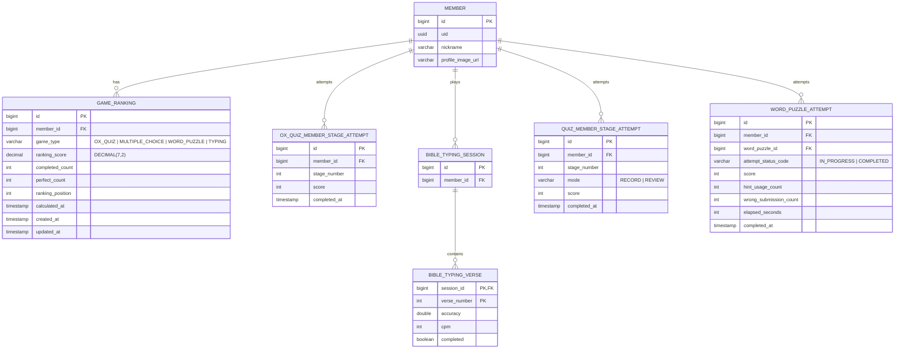
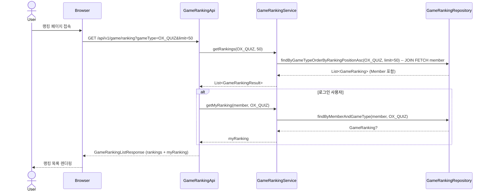
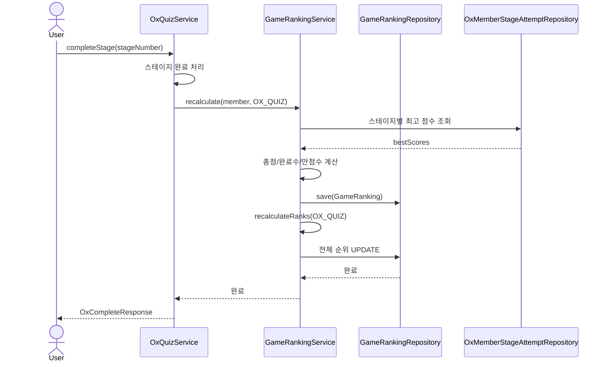

# 게임 점수 랭킹(순위) 조회 기능 설계문서

## 1. 개요

ElSeeker 게임 모듈에 **점수 기반 랭킹(순위) 조회 기능**을 추가한다.
사용자는 자신의 순위와 상위 랭커를 확인하며, 게임 참여 동기를 높인다.

### 1.1 대상 게임

| 게임 | 점수 기준 | 최대 점수 | 원본 테이블 |
|------|-----------|-----------|-------------|
| O/X 퀴즈 | 스테이지별 최고 점수 합산 | 660점 (66스테이지 × 10점) | `ox_quiz_member_stage_attempt` |
| 객관식 퀴즈 | 스테이지별 최고 점수 합산 | 660점 (66스테이지 × 10점) | `quiz_member_stage_attempt` |
| 단어 퍼즐 | 퍼즐별 최고 점수 합산 | 가변 (퍼즐 수 × 최대 2,000점) | `word_puzzle_attempt` |
| 성경 타이핑 | 절별 정확도 평균 | 100.00점 | `bible_typing_verse` |

### 1.2 용어 정의

| 용어 | 설명 |
|------|------|
| 랭킹 점수 (ranking_score) | 게임별 산출 공식에 따라 계산된 종합 점수 |
| 순위 (rank) | 랭킹 점수 기준 내림차순 정렬 시 위치 (동점 시 동일 순위) |
| 시즌 | 랭킹 집계 기간 (v1은 전체 기간, 향후 시즌제 확장 가능) |

---

## 2. 현재 게임 점수 구조 분석

### 2.1 O/X 퀴즈

```
게임 흐름: 스테이지 선택 → 10문제 풀기 → 점수 기록
```

**핵심 엔티티:**
- `OxMemberStageAttempt`: 사용자의 스테이지 시도 기록
  - `member_id`, `stage_number`, `score` (0~10), `completed_at`
- 스테이지 재도전 가능 → 최고 점수(best score)만 랭킹에 반영

**랭킹 점수 산출:**
```sql
-- 사용자별 O/X 퀴즈 랭킹 점수
SELECT member_id,
       SUM(best_score) AS ranking_score,
       COUNT(*) AS completed_stages
FROM (
    SELECT member_id, stage_number, MAX(score) AS best_score
    FROM ox_quiz_member_stage_attempt
    WHERE completed_at IS NOT NULL
    GROUP BY member_id, stage_number
) sub
GROUP BY member_id
ORDER BY ranking_score DESC;
```

### 2.2 객관식 퀴즈

```
게임 흐름: 스테이지 선택 → 객관식 문제 풀기 → 점수 기록
```

**핵심 엔티티:**
- `QuizMemberStageAttempt` (테이블: `quiz_member_stage_attempt`): 사용자의 스테이지 시도 기록
  - `member_id`, `stage_number`, `score` (0~10), `mode` (RECORD/REVIEW), `completed_at`
- `QuizStageProgress` (테이블: `quiz_stage_progress`): 스테이지 진행 상태
  - `member_id`, `stage_number`, `last_score`, `review_count`
- RECORD 모드만 랭킹에 반영 (REVIEW 모드는 학습용, 점수 미반영)

**랭킹 점수 산출:**
```sql
-- 사용자별 객관식 퀴즈 랭킹 점수
SELECT member_id,
       SUM(best_score) AS ranking_score,
       COUNT(*) AS completed_stages
FROM (
    SELECT member_id, stage_number, MAX(score) AS best_score
    FROM quiz_member_stage_attempt
    WHERE completed_at IS NOT NULL AND mode = 'RECORD'
    GROUP BY member_id, stage_number
) sub
GROUP BY member_id
ORDER BY ranking_score DESC;
```

### 2.3 단어 퍼즐

```
게임 흐름: 퍼즐 선택 → 십자말풀이 → 점수 계산 (기본점수 - 감점 + 시간보너스)
```

**핵심 엔티티:**
- `WordPuzzleAttempt` (테이블: `word_puzzle_attempt`): 퍼즐 시도 기록
  - `member_id`, `word_puzzle_id`, `score` (계산식 기반), `attempt_status_code` (IN_PROGRESS/COMPLETED)
  - `hint_usage_count`, `wrong_submission_count`, `elapsed_seconds`
- 난이도별 기본 점수: EASY(500), NORMAL(1,000), HARD(1,500)

**점수 계산 공식:**
```
score = MAX(0, 기본점수 - (힌트 사용 × 50) - (오답 제출 × 100) + 시간보너스)
시간보너스 = 제한시간 내 완료 시 500 × (1 - 소요시간/제한시간), 초과 시 0
```

| 난이도 | 기본 점수 | 제한 시간 | 최대 점수 |
|--------|-----------|-----------|-----------|
| EASY | 500 | 300초 (5분) | 1,000 |
| NORMAL | 1,000 | 600초 (10분) | 1,500 |
| HARD | 1,500 | 1,200초 (20분) | 2,000 |

**랭킹 점수 산출:**
```sql
-- 사용자별 단어 퍼즐 랭킹 점수
SELECT member_id,
       SUM(best_score) AS ranking_score,
       COUNT(*) AS completed_puzzles
FROM (
    SELECT member_id, word_puzzle_id, MAX(score) AS best_score
    FROM word_puzzle_attempt
    WHERE attempt_status_code = 'COMPLETED' AND score IS NOT NULL
    GROUP BY member_id, word_puzzle_id
) sub
GROUP BY member_id
ORDER BY ranking_score DESC;
```

### 2.4 성경 타이핑

```
게임 흐름: 장/절 선택 → 타이핑 → 정확도/속도 기록
```

**핵심 엔티티:**
- `BibleTypingVerse`: 절별 타이핑 결과 (복합 PK: `session_id` + `verse_number`)
  - `accuracy: Double` (0.0~100.0), `cpm` (분당 타자수), `completed: Boolean`
- `BibleTypingSession`: 타이핑 세션
  - `member_id`, `translation_id`, `book_order`, `chapter_number`

**랭킹 점수 산출:**
```sql
-- 사용자별 타이핑 랭킹 점수 (평균 정확도)
SELECT s.member_id,
       ROUND(AVG(v.accuracy), 2) AS avg_accuracy,
       COUNT(*) AS completed_verses
FROM bible_typing_verse v
JOIN bible_typing_session s ON v.session_id = s.id
WHERE v.completed = true
GROUP BY s.member_id
ORDER BY avg_accuracy DESC;
```

---

## 3. 기능 요구사항

### 3.1 기능 목록

| ID | 기능 | 설명 | 우선순위 |
|----|------|------|----------|
| R-01 | 게임별 랭킹 목록 조회 | 4개 게임(O/X, 객관식, 퍼즐, 타이핑) 각각의 상위 N명 랭킹 | P0 |
| R-02 | 내 순위 조회 | 로그인 사용자의 현재 순위와 점수 | P0 |
| R-03 | 랭킹 페이지 | 게임별 탭으로 전환 가능한 랭킹 UI | P0 |
| R-04 | 랭킹 캐시 | 빈번한 조회 대비 캐시 적용 | P1 |
| R-05 | 시즌별 랭킹 | 기간별 랭킹 분리 (향후) | P2 |

### 3.2 비기능 요구사항

- 랭킹 조회 응답 시간: 500ms 이내
- 동시 접속 100명 기준 안정적 처리
- 랭킹은 실시간이 아닌 **준실시간** (게임 완료 시 갱신)

---

## 4. ERD



### 4.1 GAME_RANKING 테이블 설계

| 컬럼 | 타입 | 설명 | 제약조건 |
|------|------|------|----------|
| `id` | BIGINT | PK | AUTO_INCREMENT |
| `member_id` | BIGINT | 사용자 FK | NOT NULL, FK(member) |
| `game_type` | VARCHAR(20) | 게임 유형 | NOT NULL, ENUM(OX_QUIZ, MULTIPLE_CHOICE, WORD_PUZZLE, TYPING) |
| `ranking_score` | DECIMAL(7,2) | 랭킹 점수 (OX: 정수합산, TYPING: 소수점 정확도) — Kotlin: `BigDecimal` | NOT NULL, DEFAULT 0 |
| `completed_count` | INT | 완료 스테이지/절 수 | NOT NULL, DEFAULT 0 |
| `perfect_count` | INT | 만점 스테이지/절 수 | NOT NULL, DEFAULT 0 |
| `ranking_position` | INT | 순위 (`rank`는 PostgreSQL 예약어이므로 회피) | NOT NULL, DEFAULT 0 |
| `calculated_at` | TIMESTAMP | 마지막 계산 시각 | NOT NULL |
| `created_at` | TIMESTAMP | 생성일 | NOT NULL |
| `updated_at` | TIMESTAMP | 수정일 | NOT NULL |

**인덱스:**
```sql
CREATE UNIQUE INDEX idx_game_ranking_member_type ON game_ranking (member_id, game_type);
CREATE INDEX idx_game_ranking_type_rank ON game_ranking (game_type, ranking_position);
CREATE INDEX idx_game_ranking_type_score ON game_ranking (game_type, ranking_score DESC);
```

### 4.2 설계 결정: 별도 테이블 vs 실시간 집계

| 방식 | 장점 | 단점 |
|------|------|------|
| **별도 테이블 (채택)** | 빠른 조회, 인덱스 최적화 용이, 순위 미리 계산 | 데이터 동기화 필요 |
| 실시간 집계 | 항상 최신 데이터 | 복잡한 쿼리, 사용자 증가 시 성능 저하 |

→ `GAME_RANKING` 테이블에 미리 계산된 점수와 순위를 저장하고, 게임 완료 시 갱신한다.

### 4.3 성능 고려사항: 순위 재계산 전략

현재 설계는 게임 완료 시 `recalculateRanks()`로 해당 게임 타입의 **전체 행**을 `DENSE_RANK()`로 갱신한다.
현재 규모(~100명 동시 접속)에서는 문제없으나, 1,000명 이상 활성 사용자 시 쓰기 병목이 될 수 있다.

**대안 (향후 필요 시):**
- **주기적 배치**: 5분마다 스케줄러로 순위 재계산 (준실시간 허용 시)
- **온디맨드 순위**: `COUNT(*) WHERE ranking_score > :myScore` 로 조회 시 계산 (ranking_position 컬럼 불필요)

---

## 5. API 설계

### 5.1 엔드포인트

| Method | Path | 설명 | 인증 |
|--------|------|------|------|
| GET | `/api/v1/game/ranking` | 게임별 랭킹 목록 조회 | 선택 |
| GET | `/api/v1/game/ranking/me` | 내 순위 조회 | 필수 |

### 5.2 랭킹 목록 조회

```
GET /api/v1/game/ranking?gameType=OX_QUIZ&limit=50
```

**Query Parameters:**

| 파라미터 | 타입 | 필수 | 기본값 | 설명 |
|----------|------|------|--------|------|
| `gameType` | String | Y | - | `OX_QUIZ`, `MULTIPLE_CHOICE`, `WORD_PUZZLE`, `TYPING` |
| `limit` | Int | N | 50 | 조회 인원 수 (최대 100) |

**Response:**
```json
{
  "gameType": "OX_QUIZ",
  "totalParticipants": 234,
  "rankings": [
    {
      "rank": 1,
      "nickname": "성경마스터",
      "profileImageUrl": "/images/default-profile.png",
      "rankingScore": 580,
      "completedCount": 62,
      "perfectCount": 45
    },
    {
      "rank": 2,
      "nickname": "말씀사모",
      "profileImageUrl": null,
      "rankingScore": 540,
      "completedCount": 58,
      "perfectCount": 38
    }
  ],
  "myRanking": {
    "rank": 15,
    "rankingScore": 320,
    "completedCount": 40,
    "perfectCount": 12
  }
}
```

> `myRanking`은 로그인 사용자에게만 포함된다. 비로그인 시 `null`.

### 5.3 내 순위 조회

```
GET /api/v1/game/ranking/me?gameType=OX_QUIZ
```

**Response:**
```json
{
  "gameType": "OX_QUIZ",
  "rank": 15,
  "totalParticipants": 234,
  "rankingScore": 320,
  "completedCount": 40,
  "perfectCount": 12,
  "topPercent": 6.4
}
```

---

## 6. 백엔드 구조 (Hexagonal Architecture)

```
game/
  adapter/input/api/client/
    GameRankingApi.kt              -- @RestController
    GameRankingApiDocument.kt      -- Swagger 문서 인터페이스
    request/
      (query parameter만 사용, 별도 request 없음)
    response/
      GameRankingResponses.kt      -- 랭킹 응답 DTO
  adapter/input/web/client/
    GameWebController.kt           -- 랭킹 페이지 뷰 (기존 컨트롤러에 추가)
  adapter/output/jpa/
    GameRankingRepository.kt       -- Spring Data JPA
  application/service/
    GameRankingService.kt          -- 랭킹 조회 + 갱신 로직
  domain/model/
    GameRanking.kt                 -- @Entity
  domain/vo/
    GameType.kt                    -- enum (OX_QUIZ, MULTIPLE_CHOICE, WORD_PUZZLE, TYPING)
```

### 6.1 핵심 클래스

**GameRanking.kt (Entity)**
```kotlin
@Entity
@Table(name = "game_ranking")
class GameRanking(
    id: Long? = null,

    @ManyToOne(fetch = FetchType.LAZY)
    @JoinColumn(name = "member_id", nullable = false)
    val member: Member,

    @Enumerated(EnumType.STRING)
    @Column(nullable = false, length = 20)
    val gameType: GameType,

    @Column(name = "ranking_score", nullable = false, precision = 7, scale = 2)
    var rankingScore: BigDecimal = BigDecimal.ZERO,

    @Column(nullable = false)
    var completedCount: Int = 0,

    @Column(nullable = false)
    var perfectCount: Int = 0,

    @Column(name = "ranking_position", nullable = false)
    var rankingPosition: Int = 0,

    @Column(nullable = false)
    var calculatedAt: Instant = Instant.now()
) : BaseTimeEntity(id = id)
```

**GameRankingService.kt (핵심 로직)**
```kotlin
@Service
class GameRankingService(
    private val gameRankingRepository: GameRankingRepository,
    private val oxStageAttemptRepository: OxMemberStageAttemptRepository,
    private val quizStageAttemptRepository: QuizStageAttemptRepository,
    private val wordPuzzleAttemptRepository: WordPuzzleAttemptRepository,
    private val typingVerseRepository: BibleTypingVerseRepository
) {
    /** 게임 완료 시 호출 — 해당 사용자의 랭킹 점수 재계산 (Member 엔티티 기반) */
    @Transactional
    fun recalculate(member: Member, gameType: GameType) { ... }

    /** 전체 순위 재정렬 (점수 변경 후) */
    @Transactional
    fun recalculateRanks(gameType: GameType) { ... }

    // NOTE: 각 게임 서비스(OxQuizService, BibleQuizService 등)는 memberUid: UUID를 받아
    // 내부에서 Member 엔티티를 조회한 뒤 recalculate(member, gameType)를 호출한다.
    // OxMemberStageAttemptRepository 등 기존 Repository가 Member 엔티티를 파라미터로 사용하므로
    // recalculate()도 Member 엔티티를 받아 일관성을 유지한다.

    /** 랭킹 목록 조회 */
    @Transactional(readOnly = true)
    fun getRankings(gameType: GameType, limit: Int): List<GameRankingResult> { ... }

    /** 내 순위 조회 */
    @Transactional(readOnly = true)
    fun getMyRanking(member: Member, gameType: GameType): GameRankingResult? { ... }
}
```

### 6.2 랭킹 갱신 시점

```
사용자가 게임 완료
    ↓
각 게임 서비스의 완료 메서드 호출:
  - OxQuizService.completeStage()
  - BibleQuizService.completeStage()
  - WordPuzzleService.submit()
  - BibleTypingSessionService.saveVerseProgress() (completed=true인 경우만)
    ↓
각 게임 서비스는 내부에서 memberUid로 Member 엔티티를 조회한 뒤 호출:
GameRankingService.recalculate(member, gameType)
    ↓
해당 사용자의 GAME_RANKING 행 UPDATE (점수, 완료 수, 만점 수)
    ↓
GameRankingService.recalculateRanks(gameType)
    ↓
해당 게임 타입의 전체 ranking_position 컬럼 갱신
```

### 6.3 순위 계산 SQL

```sql
-- 순위 갱신 (동점 시 동일 순위)
UPDATE game_ranking gr
SET ranking_position = sub.calculated_rank
FROM (
    SELECT id,
           DENSE_RANK() OVER (
               ORDER BY ranking_score DESC, perfect_count DESC,
                        completed_count DESC, calculated_at ASC
           ) AS calculated_rank
    FROM game_ranking
    WHERE game_type = :gameType
) sub
WHERE gr.id = sub.id;
```

---

## 7. 프론트엔드 설계

### 7.1 페이지 구성

| 경로 | 설명 |
|------|------|
| `/web/game/ranking` | 게임 랭킹 페이지 |

### 7.2 UI 구조

```
┌─────────────────────────────────────┐
│  🏆 게임 랭킹                        │
├─────────────────────────────────────┤
│  [O/X] [객관식] [퍼즐] [타이핑]        │  ← 탭 전환
├─────────────────────────────────────┤
│  📊 내 순위: 15위 / 234명 (상위 6.4%)  │  ← 로그인 시 표시
│     총점: 320점 | 완료: 40 | 만점: 12  │
├─────────────────────────────────────┤
│  순위  닉네임           점수   완료   │
│  ─────────────────────────────────  │
│  🥇 1  성경마스터        580   62/66 │
│  🥈 2  말씀사모          540   58/66 │
│  🥉 3  은혜받은자        520   55/66 │
│     4  기쁨의노래        490   52/66 │
│     5  감사합니다        480   50/66 │
│    ...                              │
│    15  나 ←(하이라이트)   320   40/66 │
│    ...                              │
└─────────────────────────────────────┘
```

### 7.3 파일 구조

```
templates/game/
  game-ranking.html              -- 랭킹 페이지 템플릿

static/css/game/
  game-ranking.css               -- 랭킹 페이지 스타일

static/js/game/
  game-ranking.js                -- 탭 전환, API 호출, 렌더링
```

### 7.4 반응형 설계

| 화면 | 레이아웃 |
|------|----------|
| 모바일 (≤576px) | 카드형 리스트, 닉네임 축약, 점수/완료만 표시 |
| 태블릿 (577~991px) | 테이블형, 전체 컬럼 표시 |
| 데스크톱 (≥992px) | 테이블형, max-width 제한, 중앙 정렬 |

---

## 8. 시퀀스 다이어그램

### 8.1 랭킹 조회



### 8.2 랭킹 갱신 (게임 완료 시)



---

## 9. 점수 산출 공식

### 9.1 O/X 퀴즈

```
ranking_score = SUM(스테이지별 최고 점수)
completed_count = 완료한 스테이지 수
perfect_count = 만점(10/10) 스테이지 수

최대: 660점 (66스테이지 × 10점)
```

### 9.2 객관식 퀴즈

```
ranking_score = SUM(스테이지별 최고 점수)  -- RECORD 모드만 집계
completed_count = 완료한 스테이지 수
perfect_count = 만점(10/10) 스테이지 수

최대: 660점 (66스테이지 × 10점)
```

> O/X 퀴즈와 동일한 구조이나, `mode = 'RECORD'` 조건으로 REVIEW 모드 제외.

### 9.3 단어 퍼즐

```
ranking_score = SUM(퍼즐별 최고 점수)
completed_count = 완료한 퍼즐 수
perfect_count = 감점 없이 완료한 퍼즐 수 (hint=0, wrong=0)

점수 계산: MAX(0, 기본점수 - (힌트×50) - (오답×100) + 시간보너스)
최대: 퍼즐 수 × 2,000점 (HARD 기준)
```

### 9.4 성경 타이핑

```
ranking_score = AVG(절별 정확도)  -- 0.00~100.00 (소수점 2자리)
completed_count = 완료한 절 수
perfect_count = 정확도 100% 절 수

최대: 100.00점
```

### 9.5 동점 처리

동점 시 정렬 기준 (우선순위):
1. `ranking_score` DESC
2. `perfect_count` DESC
3. `completed_count` DESC
4. `calculated_at` ASC (먼저 달성한 사용자 우선)

---

## 10. 향후 확장 고려사항

| 항목 | 설명 | 시기 |
|------|------|------|
| 시즌제 | 월별/분기별 랭킹 리셋, 시즌 보상 | v2 |
| 종합 랭킹 | 게임별 점수를 가중 합산한 통합 순위 | v2 |
| 뱃지/칭호 | 순위 기반 보상 (상위 1%, 10% 등) | v2 |
| 친구 랭킹 | 친구 관계 기반 소규모 랭킹 | v3 |
| 주간 랭킹 | 최근 7일간 활동 기반 별도 순위 | v3 |

---

## 11. 체크리스트

- [ ] `GameType` enum 생성 (`OX_QUIZ`, `MULTIPLE_CHOICE`, `WORD_PUZZLE`, `TYPING`)
- [ ] `GameRanking` 엔티티 + Repository 생성
- [ ] `GameRankingService` 구현 (조회/갱신)
- [ ] `GameRankingApi` + Swagger 문서 구현
- [ ] `OxQuizService.completeStage()`에 랭킹 갱신 호출 추가
- [ ] `BibleQuizService.completeStage()`에 랭킹 갱신 호출 추가
- [ ] `WordPuzzleService.submit()`에 랭킹 갱신 호출 추가
- [ ] `BibleTypingSessionService.saveVerseProgress()`에 랭킹 갱신 호출 추가 (`completed=true`인 경우)
- [ ] Repository 집계 쿼리 메서드 추가:
  - `QuizStageAttemptRepository`: 사용자별 스테이지 최고 점수 집계 (RECORD 모드)
  - `WordPuzzleAttemptRepository`: 사용자별 퍼즐 최고 점수 집계
  - `BibleTypingVerseRepository` (또는 Session 경유): 사용자별 완료 절 평균 정확도 집계
- [ ] 랭킹 페이지 HTML/CSS/JS 구현
- [ ] `GameWebController`에 랭킹 페이지 라우트 추가
- [ ] `SecurityConfig` 수정:
  - `/api/v1/game/ranking` → `permitAll()` 블록에 추가 (비로그인 조회 허용)
  - `/web/game/ranking` → `/web/game/**` `.authenticated()` 규칙 앞에 `permitAll()` 예외 추가
  - `GameRankingApi`에서 `@AuthenticationPrincipal` nullable로 선언 (선택적 인증)
- [ ] 통합 테스트 작성
