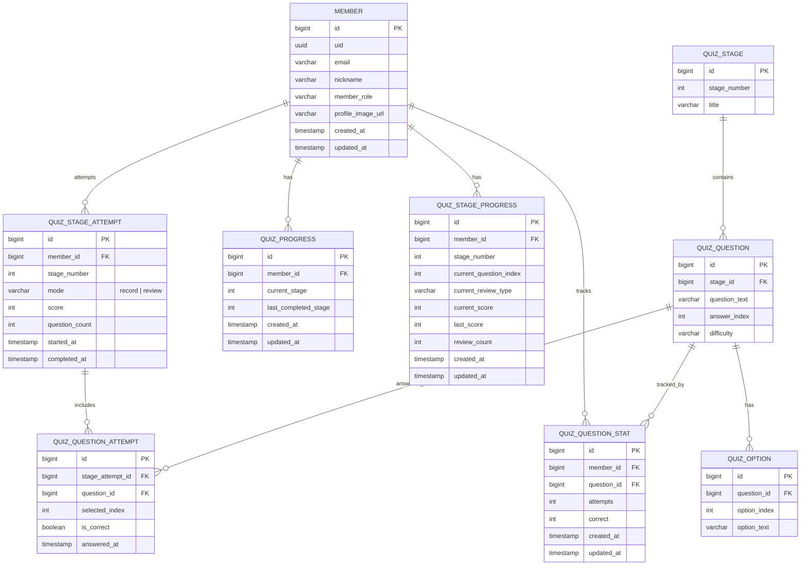

# 성경 퀴즈 ERD

```mermaid
erDiagram
    MEMBER {
        bigint id PK
        uuid uid
        varchar email
        varchar nickname
        varchar member_role
        varchar profile_image_url
        timestamp created_at
        timestamp updated_at
    }

    QUIZ_STAGE {
        bigint id PK
        int stage_number
        varchar title
    }

    QUIZ_QUESTION {
        bigint id PK
        bigint stage_id FK
        varchar question_text
        int answer_index
        varchar difficulty
    }

    QUIZ_OPTION {
        bigint id PK
        bigint question_id FK
        int option_index
        varchar option_text
    }

    QUIZ_PROGRESS {
        bigint id PK
        bigint member_id FK
        int current_stage
        int last_completed_stage
        timestamp created_at
        timestamp updated_at
    }

    QUIZ_STAGE_PROGRESS {
        bigint id PK
        bigint member_id FK
        int stage_number
        int current_question_index
        varchar current_review_type
        int current_score
        int last_score
        int review_count
        timestamp created_at
        timestamp updated_at
    }

    QUIZ_STAGE_ATTEMPT {
        bigint id PK
        bigint member_id FK
        int stage_number
        varchar mode "record | review"
        int score
        int question_count
        timestamp started_at
        timestamp completed_at
    }

    QUIZ_QUESTION_ATTEMPT {
        bigint id PK
        bigint stage_attempt_id FK
        bigint question_id FK
        int selected_index
        boolean is_correct
        timestamp answered_at
    }

    QUIZ_QUESTION_STAT {
        bigint id PK
        bigint member_id FK
        bigint question_id FK
        int attempts
        int correct
        timestamp created_at
        timestamp updated_at
    }

%% Relationships
    MEMBER ||--o{ QUIZ_PROGRESS: has
    MEMBER ||--o{ QUIZ_STAGE_PROGRESS: has
    MEMBER ||--o{ QUIZ_STAGE_ATTEMPT: attempts
    MEMBER ||--o{ QUIZ_QUESTION_STAT: tracks
    QUIZ_STAGE ||--o{ QUIZ_QUESTION: contains
    QUIZ_STAGE_ATTEMPT ||--o{ QUIZ_QUESTION_ATTEMPT: includes
    QUIZ_QUESTION ||--o{ QUIZ_OPTION: has
    QUIZ_QUESTION ||--o{ QUIZ_QUESTION_ATTEMPT: answered_in
    QUIZ_QUESTION ||--o{ QUIZ_QUESTION_STAT: tracked_by
```