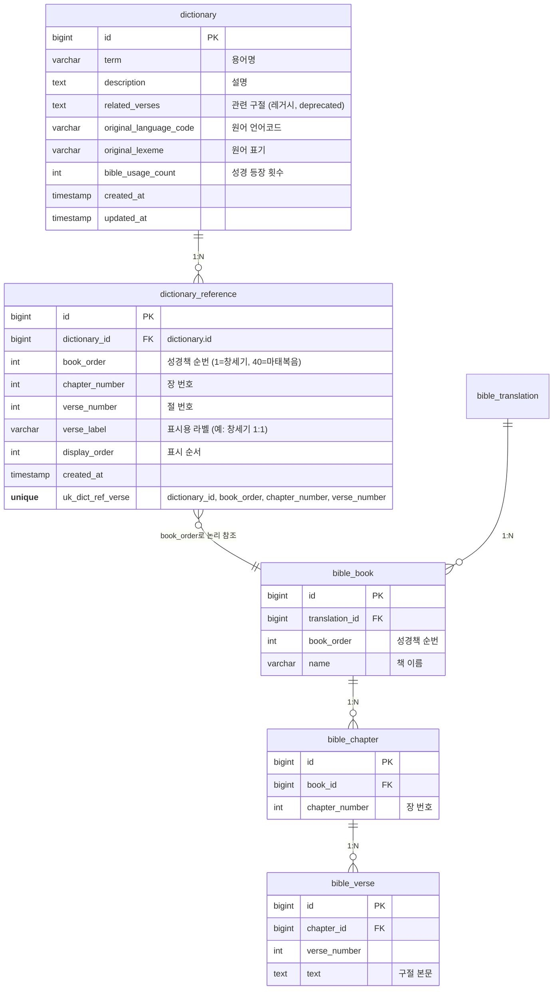

# 성경 사전 — 관련 구절 매핑 관리 설계

## 현황

### ERD



> **설계 결정**: `dictionary_reference`는 `bible_verse`에 FK를 걸지 않고 자연키(`book_order`, `chapter_number`, `verse_number`)로 참조한다.
> 사전 용어는 번역본에 독립적이므로, 조회 시 사용자의 현재 번역본으로 `bible_verse` 본문을 동적으로 resolve한다.

### 기존 테이블 vs 변경 필요 사항

현재 `dictionary_reference`는 `verse_reference`(문자열)과 `verse_excerpt`(본문 하드코딩)로 되어 있다.
이를 `book_order` + `chapter_number` + `verse_number` 자연키 구조로 변경하면:

- 구절 본문을 하드코딩하지 않고 DB에서 동적 조회 가능
- 번역본 전환 시 자동으로 해당 번역본의 본문 표시
- `verse_label`은 Admin 표시용 라벨 ("창세기 1:1")로 유지

### 테이블 구조 (이미 존재, 스키마 변경 필요)

- `dictionary_reference` 테이블과 `DictionaryReference` 엔티티는 이미 구현됨
- `Dictionary.references` — `@OneToMany(cascade=ALL, orphanRemoval=true)` 매핑 완료
- `related_verses` (TEXT) — 레거시 컬럼. 기존 구절 정보가 단순 문자열로 저장됨

### 미구현 사항

- Admin에서 `dictionary_reference` CRUD 기능 없음
- 클라이언트 사전 상세 페이지에서 `references` 활용 없음 (현재 `related_verses` TEXT만 표시)

## 구현 범위

### Phase 1 — Admin 관련 구절 관리

#### API

| Method | Endpoint | 설명 |
|--------|----------|------|
| GET | `/api/v1/admin/dictionaries/{id}/references` | 관련 구절 목록 조회 |
| POST | `/api/v1/admin/dictionaries/{id}/references` | 관련 구절 추가 |
| PUT | `/api/v1/admin/dictionaries/{id}/references/{refId}` | 관련 구절 수정 |
| DELETE | `/api/v1/admin/dictionaries/{id}/references/{refId}` | 관련 구절 삭제 |
| PUT | `/api/v1/admin/dictionaries/{id}/references/order` | 표시 순서 일괄 변경 |

#### Request/Response

```kotlin
// 추가/수정 요청
data class AdminDictionaryReferenceRequest(
    val bookOrder: Int,           // 성경책 순번 (1=창세기, 40=마태복음)
    val chapterNumber: Int,       // 장 번호
    val verseNumber: Int,         // 절 번호
    val verseLabel: String,       // 표시용 라벨 (예: "창세기 1:1")
    val displayOrder: Int = 0
)

// 순서 변경 요청
data class AdminDictionaryReferenceOrderRequest(
    val referenceIds: List<Long>  // 순서대로 정렬된 ID 목록
)
```

```kotlin
// 조회 응답
data class AdminDictionaryReferenceResponse(
    val referenceId: Long,
    val bookOrder: Int,
    val chapterNumber: Int,
    val verseNumber: Int,
    val verseLabel: String,       // "창세기 1:1"
    val verseText: String?,       // 동적 resolve된 구절 본문 (번역본 미존재 시 null)
    val displayOrder: Int
)
```

> 구절 본문(`verseText`)은 Request에 포함하지 않는다.
> 조회 시 `book_order` + `chapter_number` + `verse_number` + 사용자 번역본으로 `bible_verse`에서 동적 resolve한다.

#### Admin 웹 페이지

- 사전 수정 폼(`admin-dictionary-form.html`)에 관련 구절 관리 섹션 추가
- 구절 추가/삭제/순서 변경(드래그 or 화살표 버튼) UI

### Phase 2 — 클라이언트 반영

- 사전 상세 페이지에서 `references` 데이터로 관련 구절 표시
- 구절 클릭 시 해당 성경 구절 페이지로 이동
- 레거시 `related_verses` TEXT 컬럼은 유지하되, 표시 우선순위를 `references`로 전환

### Phase 3 — 레거시 마이그레이션 (선택)

- 기존 `related_verses` TEXT 데이터를 파싱하여 `dictionary_reference` 레코드로 이관
- 이관 완료 후 `related_verses` 컬럼 deprecate
